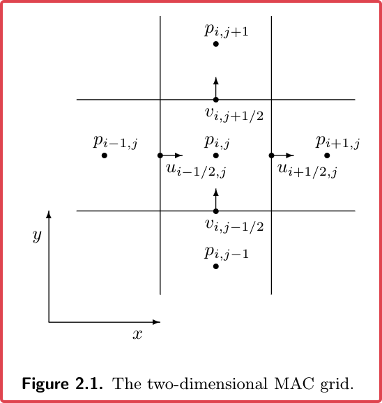
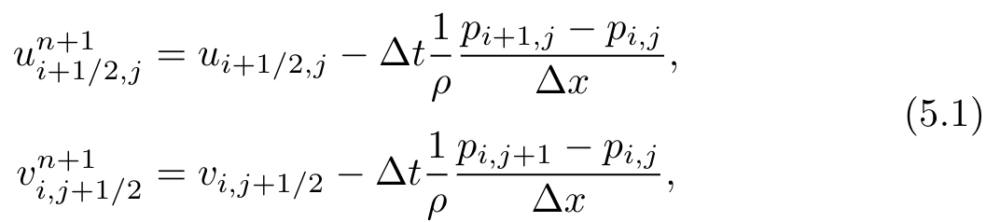
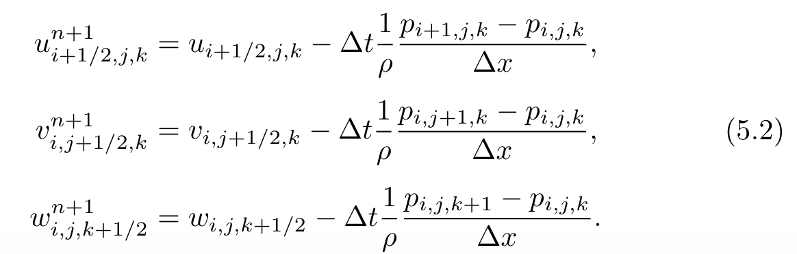
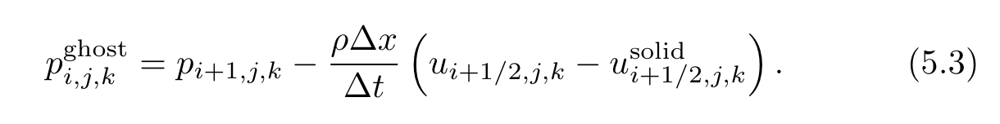
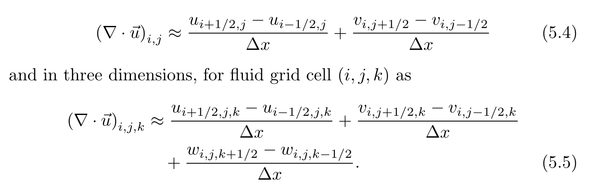
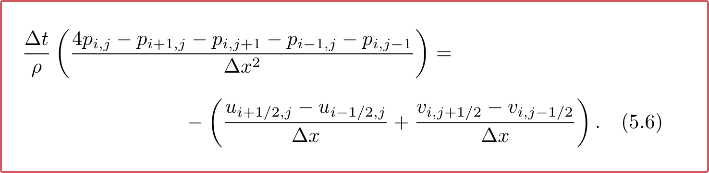
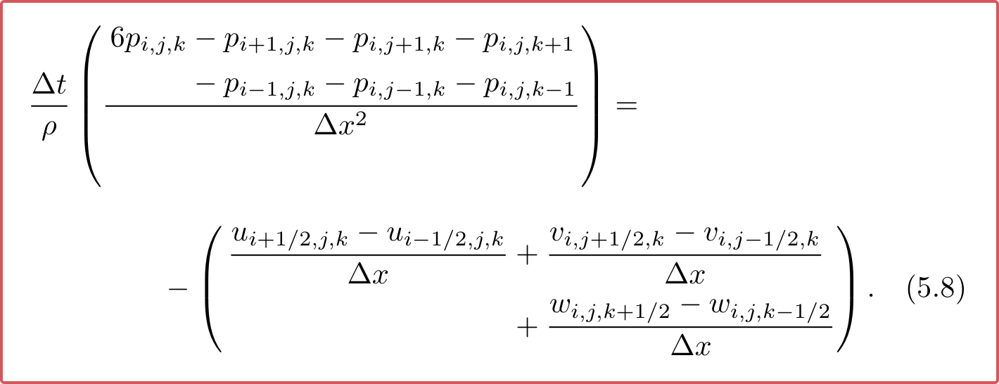
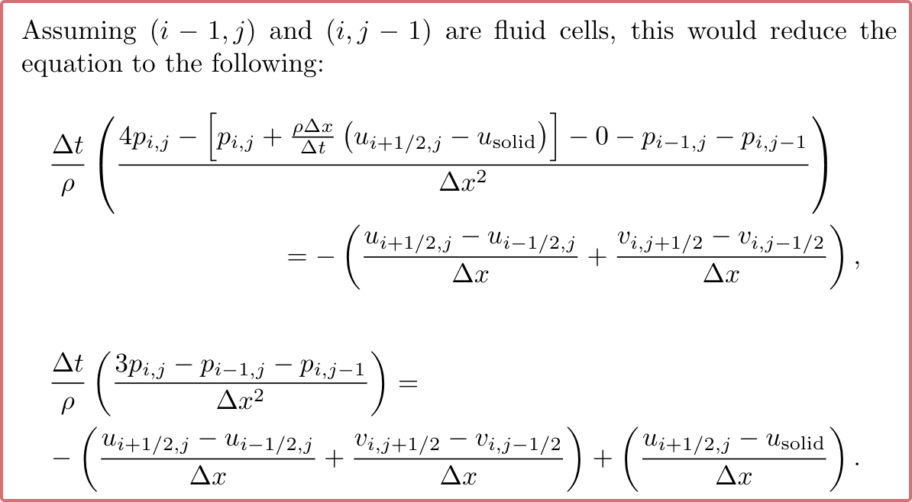
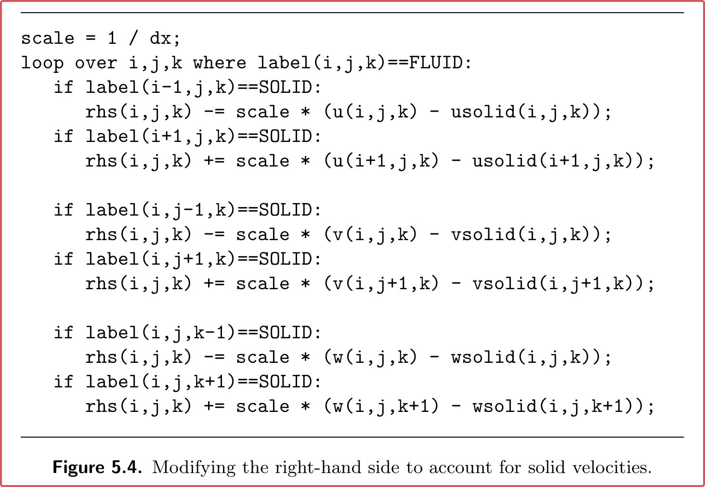

<!-- more -->

# Fluid Simulation in Computer Graphics

Reference: Fluid_Simulation_for_Computer_Graphics_Second_Edition optimized-medium-res.pdf

# The Equations of Fluids

> [Fluid_Simulation_for_Computer_Graphics_Second_Edition optimized-medium-res.pdf - p16 - Most fluid flow of interest in animation is governed by the famous incompressible Navier-Stokes equations, a set of partial differential equations that are supposed to hold throughout the fluid. ]

流体控制方程主要是如下形式：（非守恒形式）

> [Navier–Stokes equations](https://en.wikipedia.org/wiki/Navier–Stokes_equations)

$$
\begin{aligned}
\frac{\partial \vec u}{ \partial t} + \vec u \cdot \nabla \vec u + \frac 1 {\rho} \nabla p
&= \vec g + \nu\nabla ^2 \vec u\\
\nabla \cdot \vec u& = 0
\end{aligned}
$$

## Symbols

1. $\vec u$ 表示速度场1 s
2. $\rho$ 表示流体的密度，

    1. 对于水而言，约为$1000 kg/m^3$
    2. 对于空气而言，约为 $1.3 kg/ m^3$，约为水的1/700
3. $\rho$ 表示压强
4. $\vec g$ 表示重力加速度 设定为 $(0, -9.81, 0) m/s^2$
5. $\nu$ 表示粘度（Kinematic Viscosity）

> Viscosity：The **viscosity** of a [fluid](https://en.wikipedia.org/wiki/Fluid) is a measure of its [resistance](https://en.wikipedia.org/wiki/Drag_(physics)) to deformation at a given rate. For liquids, it corresponds to the informal concept of "thickness": for example, [syrup](https://en.wikipedia.org/wiki/Syrup) has a higher viscosity than [water](https://en.wikipedia.org/wiki/Water).[[1](https://en.wikipedia.org/wiki/Viscosity#cite_note-FOOTNOTESymon1971-1)]
>
> ​​

## The Momentum Equation

> $$
> \begin{aligned}
> \frac{\partial \vec u}{ \partial t} + \vec u \cdot \nabla \vec u + \frac 1 {\rho} \nabla p
> &= \vec g + \nu\nabla ^2 \vec u\\
> \nabla \cdot \vec u& = 0
> \end{aligned}
> $$

我们从材料导数开始推导：

$$
m \frac{D\vec u}{Dt} = \vec F
$$

分别考虑重力、压强、粘度的影响。

1. Fluid_Simulation_for_Computer_Graphics_Second_Edition optimized-medium-res.pdf - p18 - We only see an effect on the fluid particle when there is an imbalance, i.e. higher pressure on one side of the particle than on the other side, resulting in a force pointing away from the high pressure and toward the low pressure.

    $-\nabla p V$
2. Fluid_Simulation_for_Computer_Graphics_Second_Edition optimized-medium-res.pdf - p18 - A viscous fluid tries to resist deforming.

    Fluid_Simulation_for_Computer_Graphics_Second_Edition optimized-medium-res.pdf - p18 - that tries to minimize differences in velocity between nearby bits of fluid

    $V\mu \nabla \cdot \nabla \vec u$

因此：

$$
m \frac{D\vec u}{D t} = m\vec g - V \nabla p + V \mu \nabla^2\vec u
$$

考虑到$\lim_{V\rightarrow 0}m / V = \rho$，可以得到：

$$
\frac{D\vec u}{D t} + \rho ^{-1} \nabla p = \vec g + \nu \nabla^2\vec u
$$

‍

## 拉格朗日视角和欧拉视角

1. 拉格朗日视角：将整个连续体用离散的粒子系统模拟

    1. Vortex Methods
    2. SPH
2. 欧拉视角：监控固定位置处流体的物理量情况

联系两个视角，可以通过材料导数来进行。

$$
\begin{aligned}
\frac{d}{dt}q(t, \vec x (t)) &= \frac{\partial q}{\partial t} + \nabla q \cdot \frac{d\vec x}{dt} = \frac{D q}{Dt}\\
&= \frac{\partial q }{\partial t} + u  \frac{\partial q }{\partial x } + v  \frac{\partial q }{\partial y} + w  \frac{\partial q }{\partial z} 
\end{aligned}
$$

> Fluid_Simulation_for_Computer_Graphics_Second_Edition optimized-medium-res.pdf - p21 - Let’s review the two terms that go into the material derivative. The first is ∂q/∂t, which is just how fast q is changing at that fixed point in space, an Eulerian measurement. The second term, ∇q · ~u, is correcting for how much of that change is due just to differences in the fluid flowing past

Def: **Advection ​**使用材料导数解如下的方程：

$$
Dq/Dt = 0
$$

* 说明该量在拉格朗日视角下是不变的（守恒的）
* Fluid_Simulation_for_Computer_Graphics_Second_Edition optimized-medium-res.pdf - p22 - This just means the quantity is moving around but isn’t changing in the Lagrangian viewpoint.

### Example

考虑一维的情况，取 $q$ 为温度 $T$：

$$
T(x) = 10x
$$

如果粒子之间温度是守恒的，那么

$$
DT/Dt = 0
$$

且有速度场$\vec u = c$，那么对于空间中的固定点而言，

$$
\frac{\partial T} {\partial t} = -10c
$$

### Advecting Vector Quantities

假设$\vec C = (R, G, B)$ 那么

$$
D\vec C/Dt = \frac{\partial \vec C}{\partial t} + \vec u\cdot \nabla \vec C
$$

例如，对于速度场的导数计算而言：

$$
D\vec u/ D t = \frac{\partial u}{\partial t} + \vec u \cdot \nabla \vec u
$$

* $\vec u$ 表示的是粒子的速度

## Incompressibility

描述流体体积不变的性质

$$
\frac{d}{dt} V = \iint_{\partial \Omega} \vec u\cdot \hat n \quad(=0)
$$

我们使用外微分形式，进一步化简结果：

$$
\nabla \cdot \vec u =0
$$

> Divergence-Free - 无散场

被称为不可压缩条件。

* 压强可以将其视为拉格朗日乘子项看待

压强出现在动量方程中，动量方程两边同时取散度：

$$
\nabla \cdot \frac{1}{\rho} \nabla p=\nabla \cdot (-\vec u\cdot \nabla \vec u + \vec g + \nu \nabla ^2 \vec u)
$$

## Dropping Viscosity

无粘性的流体 $\nu = 0$  

因此整体的方程变为：

$$
\begin{aligned}
\frac {D \vec u}{Dt} + \frac{1}{\rho}\nabla p = \vec g
\\
\nabla \cdot \vec u = 0
\end{aligned}
$$

> Fluid_Simulation_for_Computer_Graphics_Second_Edition optimized-medium-res.pdf - p26 - The Navier-Stokes equations without viscosity are called the Euler equations and such an ideal fluid with no viscosity is called inviscid.

该方程是我们主要使用的方程。

## Boundary Conditions

考虑两类边界条件：

1. Solid Walls：$\vec u\cdot \hat n = 0$，如果solid运动，则有$\vec u\cdot \hat n = \vec u_{solid}\cdot \hat n$ - 有时也称为no-stick condition。 - Inviscid Fluid.
2. Free Surfaces：空气对水面的影响非常小，看作$p=0$的表面，

问题：如何计算流固边界压强？

# Numerical Simulation

## Splitting

目的：降低原本公式的复杂度

例如，对于：

$$
dq/dt = f(q) + g(q)
$$

可以通过splitting简化为：

$$
\begin{aligned}
\tilde q = q^n + \Delta t f(q^n)\\
q^{n+1} = \tilde q + \Delta t g(\tilde q)
\end{aligned}
$$

可以通过 Taylor 展开发现，该公式具有一阶精度。

对于上下两个式子，可以使用不同的积分格式（显、隐式、阶数）

$$
\begin{aligned}
\tilde q& = \mathcal F(\delta t, q^n)\\
q^{n+1}& = \mathcal G(\delta t, \tilde q)
\end{aligned}
$$

> Fluid_Simulation_for_Computer_Graphics_Second_Edition optimized-medium-res.pdf - p32 - Splitting really is just the principle of divide-and-conquer applied to differential equations: solving the whole problem may be too hard, but you can split it into pieces that are easier to solve and then combine the solutions

## Splitting the Fluid Equations

$$
\begin{aligned}
Dq/Dt & = 0&(advection)\\
\frac{\partial \vec u } {\partial t} &= \vec g &(forces)\\
\frac{\partial \vec u } {\partial t} + \frac 1\rho\nabla p &= 0\\
s.t. \nabla \cdot \vec u & = 0&(pressure/incompressibility)
\end{aligned}
$$

> Fluid_Simulation_for_Computer_Graphics_Second_Edition optimized-medium-res.pdf - p33 - We used the generic quantity q in the advection equation because we may be interested in advecting other things, not just velocity ~v.

1. Advection Step: Chapter 3
2. Body force: use forward euler is fine
3. Pressure, Incompressibility: Chapter 5

```
Init();
for-each Timestep:
  Advect();
  ApplyExternalForces();
  Project();
```

> Fluid_Simulation_for_Computer_Graphics_Second_Edition optimized-medium-res.pdf - p33 - Fluid_Simulation_for_Computer_Graphics_Second_Edition optimized-medium-res-P33-20230104194916

## Time Steps

1. $t_{n+1}=t_{frame}$ may be a bad idea, because of Floating Point loss
2. $\Delta t$ 要考虑满足Splitting Method中各步骤

Typically：至少为 1/3 的Frame Time

## Grids

MAC Grid

> Fluid_Simulation_for_Computer_Graphics_Second_Edition optimized-medium-res.pdf - p35 - Fluid_Simulation_for_Computer_Graphics_Second_Edition optimized-medium-res-P35-20230125121752
>
> ​

为何不使用普通 Grid：

Fluid_Simulation_for_Computer_Graphics_Second_Edition optimized-medium-res.pdf - p36 - The problem with formula (2.11) is technically known as having anon-trivial null-space: the set of functions where the formula evaluates tozero contains more than just the constant functions to which it should berestricted.

> 中心差分允许$q_{i} \ne q_{i-1} = q_{i+1}$

但MAC-Grid允许有二阶精度、估计是无偏的。

Fluid_Simulation_for_Computer_Graphics_Second_Edition optimized-medium-res.pdf - p37 - Fluid_Simulation_for_Computer_Graphics_Second_Edition optimized-medium-res-P37-20230125143514  
计算公式如上。

Fluid_Simulation_for_Computer_Graphics_Second_Edition optimized-medium-res.pdf - p38 - Fluid_Simulation_for_Computer_Graphics_Second_Edition optimized-medium-res-P38-20230125143610

需要存储的代码实现如上

## Two Dimensional Simulations

Always prototype a 3d solver in 2d first!

# Advection Algorithms

主要讲Grid上如何进行速度→位移的更新。

* Time step size：CFL condition。Fluid_Simulation_for_Computer_Graphics_Second_Edition optimized-medium-res.pdf - p48 - CFL condition. 

令$c = \max\|u\|$, CFL:

$$
\Delta t = \alpha \Delta x / c
$$

其中 $\alpha$ 为CFL-Number（常数）

# Level Set Geometry

主要讲水平集相关的操作、Marching Cube算法来可视化流体

# Making Fluids Incompressible

project 方法是对于$u$的操作：在满足边界条件的情况下：

一种理解是从**压强计算**的角度来看：

$$
u^* = u - \Delta t \frac 1 {\rho} \nabla p
$$

另一种视角是说：

$$
\nabla \cdot u^* = 0
$$

## Discrete Pressure Gradient

（离散压强梯度）

压强可以用于直接求解出不可压缩流体自身产生的加速度场，公式如下：

Fluid_Simulation_for_Computer_Graphics_Second_Edition optimized-medium-res.pdf - p82 - Fluid_Simulation_for_Computer_Graphics_Second_Edition optimized-medium-res-P82-20230125145851

​​

​​

对于两类边界条件：

1. Dirichlet边界，例如空气和流体的界面，其压强为0，直接设置为0即可。Fluid_Simulation_for_Computer_Graphics_Second_Edition optimized-medium-res.pdf - p82 - This is called a Dirichlet boundary condition if you’re interested in the technical lingo: Dirichlet means we’re directly specifying the value of the quantity at the boundary.
2. Neumann边界条件，对于固体边界面，直接设置流体速度为固体速度，作为速度场的后处理。Ghost value for pressure inside.

​​

## Discrete divergence

可以直接计算出Divergence，如下：

Fluid_Simulation_for_Computer_Graphics_Second_Edition optimized-medium-res.pdf - p85 - Fluid_Simulation_for_Computer_Graphics_Second_Edition optimized-medium-res-P85-20230125153857  

​​

## Pressure Equations

通过上述几个公式，推导并整理得到（流体内部）：

> 左侧实际上是离散Laplace算子，右侧为$\nabla \cdot u$Fluid_Simulation_for_Computer_Graphics_Second_Edition optimized-medium-res.pdf - p88 - ：Observe that Equations (5.6) and (5.8) are numerical approximations to the Poisson problem −∆t/ρ∇ · ∇p = −∇ · ~u.

（2D）Fluid_Simulation_for_Computer_Graphics_Second_Edition optimized-medium-res.pdf - p87 - Fluid_Simulation_for_Computer_Graphics_Second_Edition optimized-medium-res-P87-20230126112635  
​​

（3D）Fluid_Simulation_for_Computer_Graphics_Second_Edition optimized-medium-res.pdf - p88 - Fluid_Simulation_for_Computer_Graphics_Second_Edition optimized-medium-res-P88-20230126112652  
​​

> Fluid_Simulation_for_Computer_Graphics_Second_Edition optimized-medium-res.pdf - p88 - If a fluid grid cell is at the boundary, recall that the new velocities on the boundary faces involve pressures outside the fluid that we have to define through boundary conditions: we need to use that here.

对于流固的边界面，引入$u_{solid}$，来进行耦合，对于流气边界，直接设置为0，公式上体现为：

Fluid_Simulation_for_Computer_Graphics_Second_Edition optimized-medium-res.pdf - p89 - Fluid_Simulation_for_Computer_Graphics_Second_Edition optimized-medium-res-P89-20230126151642  
​​

具体代码实现为

Fluid_Simulation_for_Computer_Graphics_Second_Edition optimized-medium-res.pdf - p89 - Fluid_Simulation_for_Computer_Graphics_Second_Edition optimized-medium-res-P89-20230126113237  
​​

这一小节的后半部分具体解释了如何进行求解，以及常见算法：

1. Fluid_Simulation_for_Computer_Graphics_Second_Edition optimized-medium-res.pdf - p90 - Putting It In Matrix-Vector Form
2. Fluid_Simulation_for_Computer_Graphics_Second_Edition optimized-medium-res.pdf - p91 - The Conjugate Gradient Algorithm：选用Preconditioned CG
3. Fluid_Simulation_for_Computer_Graphics_Second_Edition optimized-medium-res.pdf - p96 - Incomplete Cholesky
4. Fluid_Simulation_for_Computer_Graphics_Second_Edition optimized-medium-res.pdf - p98 - Modified Incomplete Cholesky

## Fluid_Simulation_for_Computer_Graphics_Second_Edition optimized-medium-res.pdf - p104 - More Accurate Curved Boundaries

Smoke
