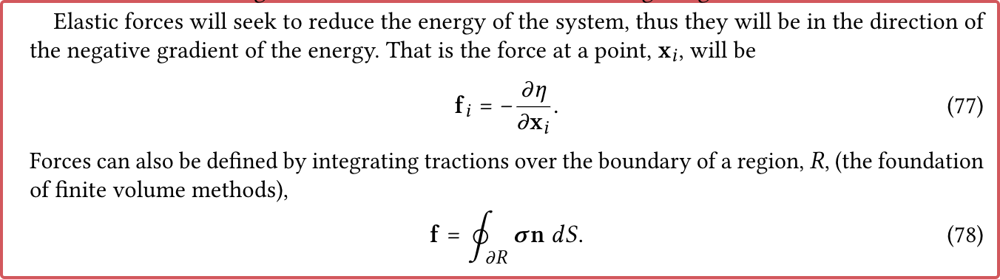
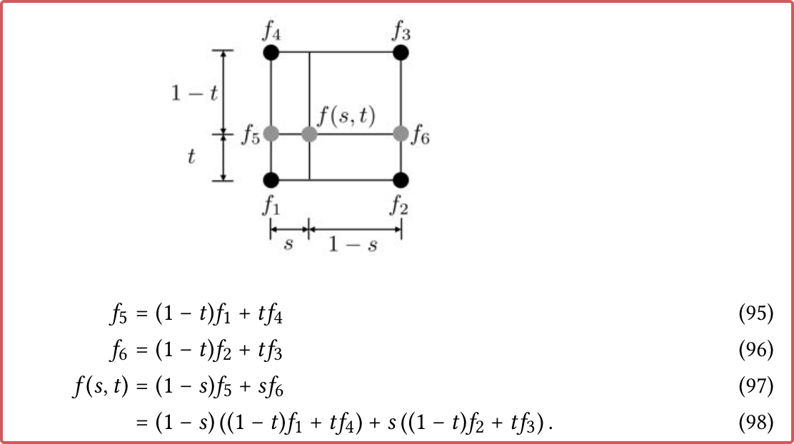

An Introduction to Physics-based Animation

<!-- more -->

# SIG21-An Introduction to Physics-based Animation


> ​ [An Introduction to Physics-based Animation](SIG21-An Introduction to Physics-based Animation/sig19 Intro to PBA optimized-20221205101915-1a7vn7h.pdf)

## A simple start: Particle Dynamics

### Passive Particle in Velocity Field

[sig19 Intro to PBA optimized.pdf - p5 - sig19 Intro to PBA optimized-P5-20230128114412](SIG21-An Introduction to Physics-based Animation/sig19 Intro to PBA optimized-20221205101915-1a7vn7h.pdf?p=5)  
‚Äã‚Äã

问题：给定速度场$v(x, t)$，求运动

本质上：I.V.P（初值问题）

$$
\begin{aligned}
x_p(0) = x_0 \\
\dot{x}_p = v(x_p, t)
\end{aligned}
$$

常微分方程 -- 只有 $t$。且是一阶 ODE。用有限差分法求。具体从解析到离散的推导为：

[sig19 Intro to PBA optimized.pdf - p5 - sig19 Intro to PBA optimized-P5-20230128114500](SIG21-An Introduction to Physics-based Animation/sig19 Intro to PBA optimized-20221205101915-1a7vn7h.pdf?p=5)  
‚Äã‚Äã

### Particle with mass

如果给定的不是速度场，而是力场，可以用牛顿第二定律来进行计算：

[sig19 Intro to PBA optimized.pdf - p6 - sig19 Intro to PBA optimized-P6-20230128114553](SIG21-An Introduction to Physics-based Animation/sig19 Intro to PBA optimized-20221205101915-1a7vn7h.pdf?p=6)  
‚Äã‚Äã

$$
\begin{aligned}
x_p(0) = x_0 \\
\ddot{x}_p = f / m
\end{aligned}
$$

或者替换为两个一阶ODE耦合的形式：

$$
\begin{aligned}
x_p(0) = x_0 \\
\dot{x}_p = v_p
\dot{v}_p = f/m
\end{aligned}
$$

最简单的，我们可以直接用差分代替微分，实现Symplectic Euler方法。（以及显式欧拉）

> 区别于半隐式欧拉。

```cpp
class Particle {
  mass
  position
  velocity
  force_accumulator
  ...
  (i.e. color, size, age, type)
};
```

> [sig19 Intro to PBA optimized.pdf - p6 - Particle structure would typically store, at a minimum: mass, position, velocity, and a force accumulator.](SIG21-An Introduction to Physics-based Animation/sig19 Intro to PBA optimized-20221205101915-1a7vn7h.pdf?p=6)

> Question: use field (SoA + ECS)

### Mass Spring System

System = Particle + Constraint

$$
f_p = k(\| x_q - x_p \|/ r - 1) (x_q - x_p) / \| x_q - x_p \|
$$

两个弹簧节点之间的相互作用力可以如上定义。算法实现如下：

[sig19 Intro to PBA optimized.pdf - p8 - sig19 Intro to PBA optimized-P8-20230128114851](SIG21-An Introduction to Physics-based Animation/sig19 Intro to PBA optimized-20221205101915-1a7vn7h.pdf?p=8)  
‚Äã‚Äã

## Mathematical Models

> Continuum Mechanics: Assume the underlying materials are continuous.

### Physics Law

主要是两大部分：

1. 牛顿力学 -- 第一定律、第二定律
2. 分析力学(变分原理等)

#### [sig19 Intro to PBA optimized.pdf - p8 -  Newton’s Laws of Motion.](SIG21-An Introduction to Physics-based Animation/sig19 Intro to PBA optimized-20221205101915-1a7vn7h.pdf?p=8)

> 1, 2, 3 定律

1. [sig19 Intro to PBA optimized.pdf - p8 - a body remains at rest or moves with a constant velocity unless acted upon by a force](SIG21-An Introduction to Physics-based Animation/sig19 Intro to PBA optimized-20221205101915-1a7vn7h.pdf?p=8)
2. [sig19 Intro to PBA optimized.pdf - p8 -  Newton’s famous second law, 𝐟 = 𝑚𝐚, ](SIG21-An Introduction to Physics-based Animation/sig19 Intro to PBA optimized-20221205101915-1a7vn7h.pdf?p=8)
3. [sig19 Intro to PBA optimized.pdf - p9 - Newton’s third law states that for every action, there is an equal and opposite reaction. Specifically, in an interaction between two particles or bodies, if body A applies force 𝐟 to body B, then body B applies force −𝐟 to body A. ](SIG21-An Introduction to Physics-based Animation/sig19 Intro to PBA optimized-20221205101915-1a7vn7h.pdf?p=9)

#### 质量守恒、动量守恒、能量守恒 [sig19 Intro to PBA optimized.pdf - p10 - Conservation of Mass, Momentum, Energy](SIG21-An Introduction to Physics-based Animation/sig19 Intro to PBA optimized-20221205101915-1a7vn7h.pdf?p=10)

守恒视角下，牛顿定律：

[sig19 Intro to PBA optimized.pdf - p10 - sig19 Intro to PBA optimized-P10-20230128154753](SIG21-An Introduction to Physics-based Animation/sig19 Intro to PBA optimized-20221205101915-1a7vn7h.pdf?p=10)  
‚Äã‚Äã

[sig19 Intro to PBA optimized.pdf - p11 - Conservation laws for continua. ](SIG21-An Introduction to Physics-based Animation/sig19 Intro to PBA optimized-20221205101915-1a7vn7h.pdf?p=11)：对于连续介质，有质量守恒给出了如下公式

$$
\frac{d}{dt} \int_\Omega \rho dV = - \oint _{\partial \Omega} \rho v(x, t) \cdot n(x) dS
$$

利用散度定理，局部的有：

$$
\frac{\partial \rho}{\partial t} + \nabla \cdot (\rho v) dV = 0
$$

### Materials

#### [sig19 Intro to PBA optimized.pdf - p12 - Rigid Bodies](SIG21-An Introduction to Physics-based Animation/sig19 Intro to PBA optimized-20221205101915-1a7vn7h.pdf?p=12)

##### 6DoF 模型

[sig19 Intro to PBA optimized.pdf - p13 - sig19 Intro to PBA optimized-P13-20230128175401](SIG21-An Introduction to Physics-based Animation/sig19 Intro to PBA optimized-20221205101915-1a7vn7h.pdf?p=13)  
‚Äã‚Äã

一个刚体只有6dof，分为Object Space 和 World Space

1. 质心位置$\mathbf x(t)$
2. 三维旋转$\mathbf r(t)$
3. 质心计算：质量加权的平均位置[sig19 Intro to PBA optimized.pdf - p12 - sig19 Intro to PBA optimized-P12-20230128175004](SIG21-An Introduction to Physics-based Animation/sig19 Intro to PBA optimized-20221205101915-1a7vn7h.pdf?p=12)  
   ‚Äã‚Äã

计算刚体上的点的世界坐标： [sig19 Intro to PBA optimized.pdf - p13 - sig19 Intro to PBA optimized-P13-20230129095515](SIG21-An Introduction to Physics-based Animation/sig19 Intro to PBA optimized-20221205101915-1a7vn7h.pdf?p=13)  
‚Äã‚Äã

通过上式对时间求微分，得到（刚体上某点的）速度方程：

$$
v(t) = \dot{x}(t) + \dot{R} (t) r_0
$$

##### 线速度、角速度[sig19 Intro to PBA optimized.pdf - p13 - Linear and Angular Velocity](SIG21-An Introduction to Physics-based Animation/sig19 Intro to PBA optimized-20221205101915-1a7vn7h.pdf?p=13)

线速度：[sig19 Intro to PBA optimized.pdf - p13 - 𝐱(𝑡), is referred as the rigid body linear velocity](SIG21-An Introduction to Physics-based Animation/sig19 Intro to PBA optimized-20221205101915-1a7vn7h.pdf?p=13)

Euler 旋转定理：任意旋转是沿某轴进行的。

$$
\dot{R} (t) r_0 = \omega(t) \times r(t)
$$

$\omega(t)$ 称为角速度。

**动量(Linear Momentum)**：[sig19 Intro to PBA optimized.pdf - p14 - Linear Momentum. ](SIG21-An Introduction to Physics-based Animation/sig19 Intro to PBA optimized-20221205101915-1a7vn7h.pdf?p=14)

$$
P(t) = \sum_{i=1}^{N} m_i v_i(t) = \underline{
\left(\sum_{i = 1}^N  m_i\right) \dot{x}(t)} + \omega(t) \times\sum_{i=1}^N m_i r_i(t)
$$

[sig19 Intro to PBA optimized.pdf - p15 - sig19 Intro to PBA optimized-P15-20230129111005](SIG21-An Introduction to Physics-based Animation/sig19 Intro to PBA optimized-20221205101915-1a7vn7h.pdf?p=15)  
‚Äã‚Äã

**角动量(Angular Momentum)**:[sig19 Intro to PBA optimized.pdf - p15 - Angular Momentum.](SIG21-An Introduction to Physics-based Animation/sig19 Intro to PBA optimized-20221205101915-1a7vn7h.pdf?p=15)

$$
\begin{aligned}
L(t)& = \sum_{i = 1}^{N} m_i r_i \times(\dot{x}(t) + \omega(t) \times r_i(t))
\\
&= \sum_{i = 1}^N m_i r_i(t)\times (\omega(t)\times r_i(t))
\end{aligned}
$$

因为其中的$\omega$不依赖于$i$，交换叉乘顺序并定义：

$$
r \times \omega = r^* \omega = 
\left(\begin{matrix}
0 & -r_z & r_y\\
r_z & 0 & -r_x\\
-r_y & r_x & 0
\end{matrix}\right) \omega
$$

所以有：

$$
\begin{aligned}
L(t)& = (\sum_i m_i r_i^{*} r_i^{*T}) \omega(t)\\
&=I(t) \omega (t)
\end{aligned}
$$

其中的$I(t)$通过下式计算：[sig19 Intro to PBA optimized.pdf - p16 - sig19 Intro to PBA optimized-P16-20230129112855](SIG21-An Introduction to Physics-based Animation/sig19 Intro to PBA optimized-20221205101915-1a7vn7h.pdf?p=16)  
‚Äã‚Äã

**Force and Torque**

$$
\frac{d}{dt} \left(P;L\right) = \left(f; \tau\right)
$$

其中$\tau = r \times f$

Summary: [sig19 Intro to PBA optimized.pdf - p16 - sig19 Intro to PBA optimized-P16-20230129113036](SIG21-An Introduction to Physics-based Animation/sig19 Intro to PBA optimized-20221205101915-1a7vn7h.pdf?p=16)  
‚Äã‚Äã

#### Soft Bodies

> Central: deformation gradient

$$
K(d) + D(\dot{d}) + M\ddot{d} = f_{ext}
$$

其中 

1. $d$ 是位移（指形变函数）
2. $K$表示弹性力（内部）→ 刚度矩阵
3. $D$表示衰减力
4. $M$是质量矩阵。

形变梯度的引入：[sig19 Intro to PBA optimized.pdf - p17 - Deformation Gradient](SIG21-An Introduction to Physics-based Animation/sig19 Intro to PBA optimized-20221205101915-1a7vn7h.pdf?p=17)

$u$ 是 Rest-Space，$x$ 是 World-Space，最简单的情况是

$$
x(u) = x(u_0) + A(u - u_0)
$$

$A$ 是任意矩阵。如果是更复杂的情况，可以局部线性化为上面的形式。

即：$\Psi$ （形变函数）局部线性近似 -> $F = \partial x / \partial u$ -> SVD, RS, ... (Strain Measuring)

直觉上 SVD（$F = U \Sigma V^T$）：

1. $V^T$：Rest->Aligned
2. $\Sigma$：拉伸收缩
3. $U$：Aligned->World

避免 Global Rotation后：RS 分解。

##### Strain

> Dimension-less Quantity: measures the amount of deformation.
>
> Strain represents the displacement between particles in the body relative to a reference length.
>
> [sig19 Intro to PBA optimized.pdf - p18 - Strain. From the deformation gradient we define a strain metric. Strain is a dimension-less (or unit-less) quantity that measures the amount of deformation. ](SIG21-An Introduction to Physics-based Animation/sig19 Intro to PBA optimized-20221205101915-1a7vn7h.pdf?p=18)

仅仅是**某一种**刻画形变程度的方式！

$$
Strain(x_r) = 0
$$

例如：Mass-Spring: $l / l_0$

常用的应变

1. Green's Finite Strain, -> Right Cauchy-Green Strain
2. Cauchy infinitesimal strain,
3. co-rotated strain.

E.g. Right Cauchy-Green Strain:

$$
\epsilon_{ij} = \frac{1}{2} (F^T F - I)
$$

[sig19 Intro to PBA optimized.pdf - p18 - sig19 Intro to PBA optimized-P18-20230130113230](SIG21-An Introduction to Physics-based Animation/sig19 Intro to PBA optimized-20221205101915-1a7vn7h.pdf?p=18)  
‚Äã‚Äã

[sig19 Intro to PBA optimized.pdf - p18 - sig19 Intro to PBA optimized-P18-20230130113306](SIG21-An Introduction to Physics-based Animation/sig19 Intro to PBA optimized-20221205101915-1a7vn7h.pdf?p=18)  
‚Äã‚Äã

Cauchy infinitesimal strain: 如果 $D^TD$项可以忽略。

$$
\begin{aligned}
\epsilon & = \frac{1}{2} (F^T + F + D^TD) -I & \mathrm{(Green)}\\
  & \approx \frac{1}{2} (F + F^T) - I & \mathrm{(Cauchy~infinitesimal)}
\end{aligned}
$$

如果用Einstein Notation：

[sig19 Intro to PBA optimized.pdf - p19 - sig19 Intro to PBA optimized-P19-20230130113523](SIG21-An Introduction to Physics-based Animation/sig19 Intro to PBA optimized-20221205101915-1a7vn7h.pdf?p=19)  
‚Äã‚Äã

主要好处在于，该strain是线性的，导出的形变能量是二次的，具有常数的Hessian。[sig19 Intro to PBA optimized.pdf - p19 - The primary advantage of this strain metric is that it is linear, which leads to a quadratic energy and a constant Hessian that can be pre-factored or otherwise analyzed](SIG21-An Introduction to Physics-based Animation/sig19 Intro to PBA optimized-20221205101915-1a7vn7h.pdf?p=19)

缺点在于，这个strain受到world-space rotation的影响。[sig19 Intro to PBA optimized.pdf - p19 - Unfortunately, this strain metric does penalize world-space rotations, leading to a variety of unpleasant artifacts under large deformations.](SIG21-An Introduction to Physics-based Animation/sig19 Intro to PBA optimized-20221205101915-1a7vn7h.pdf?p=19)

在图形学中最常用的是 co-rotated strain metric:

$$
\epsilon = \frac{1}{2} \left( \tilde{F} + \tilde{F}^T \right) - I
$$

- 在式子中显式地丢掉了无关的旋转，$F=Q\tilde{F}$（极分解）

##### Stress

> 描述单位面积上的力，维度相关
>
> [sig19 Intro to PBA optimized.pdf - p19 - Stress. Unlike strain, stress is not a dimension-less quantity. In three dimensions, stress has units of Newton’s per meter squared (𝑁 /𝑚2). Instead of measuring the amount of deformation, it measures the materials reaction to that deformation. ](SIG21-An Introduction to Physics-based Animation/sig19 Intro to PBA optimized-20221205101915-1a7vn7h.pdf?p=19)

常用模型是为线性的

$$
\sigma = C \epsilon
$$

其中 $C$ 是一个3x3x3x3的**张量**，但是！考虑到：

1. $\sigma, \epsilon$ 对称
2. Iso-tropic （各向同性）

只有两个参数，Lame Coefficients:

$$
\sigma_{ij} = \lambda \epsilon_{kk}\delta_{ij} + 2\mu \epsilon_{ij}
$$

矩阵形式：

$$
\sigma = \lambda Tr(\epsilon) I + 2 \mu \epsilon
$$

> [sig19 Intro to PBA optimized.pdf - p19 - the stress is some constant times the strain plus a scaled identity matrix times the trace of the strain. The second term approximately preserves volume.](SIG21-An Introduction to Physics-based Animation/sig19 Intro to PBA optimized-20221205101915-1a7vn7h.pdf?p=19)

##### 弹性能量、力

势能密度：(Einstein Notation)

$$
\eta = \frac{1}{2} \sigma_{ij} \epsilon_{ij} 
= \frac{1}{2} \sigma : \epsilon=\frac 1 2 \sum_{i, j} \sigma _{ij} \epsilon_{ij}
$$

总能量是势能密度的积分。

Traction（切向力？）：

$$
\tau = \sigma n
$$

- 其中 $n$ 是单位法向。

> $F$ 始终让总势能减少。

$$
f_i = -\frac{\partial \eta}{\partial x_i}
$$

也可以被定义区域积分：

$$
f = \int_{\partial R} \sigma n \mathrm{d}S
$$

[sig19 Intro to PBA optimized.pdf - p20 - sig19 Intro to PBA optimized-P20-20230130120242](SIG21-An Introduction to Physics-based Animation/sig19 Intro to PBA optimized-20221205101915-1a7vn7h.pdf?p=20)  
‚Äã‚Äã

##### Stress Revisit

Definition of Stress: Maps *normal* to *force*

> [sig19 Intro to PBA optimized.pdf - p20 - The definition of traction makes clear that stress maps from normals to forces (per unit area). ](SIG21-An Introduction to Physics-based Animation/sig19 Intro to PBA optimized-20221205101915-1a7vn7h.pdf?p=20)

问题在于定义的空间是 世界/物体？

* 如果是**世界坐标系**下的法向和Stress 计算得到对应 Cauchy Stress -- $\sigma$

  [sig19 Intro to PBA optimized.pdf - p20 - If both normals and forces are in world space, the stress is known as a Cauchy stress and often written as 𝝈](SIG21-An Introduction to Physics-based Animation/sig19 Intro to PBA optimized-20221205101915-1a7vn7h.pdf?p=20)
* 物体坐标系的法向到物体坐标系的力 - 对应PK stress - $S$  

  [sig19 Intro to PBA optimized.pdf - p20 - If the stress maps normals in material space to forces in material space it is known as a second Piola-Kirchhoff stress and sometimes written as 𝐒.](SIG21-An Introduction to Physics-based Animation/sig19 Intro to PBA optimized-20221205101915-1a7vn7h.pdf?p=20)
* **物体坐标系**的法向到**世界坐标系**的力 - 对应PK1 stress - P

  [sig19 Intro to PBA optimized.pdf - p20 - A first Piola-Kirchhoff stress maps normals in material space to forces in world space and is written 𝐏](SIG21-An Introduction to Physics-based Animation/sig19 Intro to PBA optimized-20221205101915-1a7vn7h.pdf?p=20)

如果是material space->material space， --  PK2 -- $S$

常用的是 PK1: Material Space Normal -> World Space Force

‍

$$
P = J \sigma F^{-T} = FS
$$

好处在于，PK1 给出的是从参考到世界坐标的映射。

[sig19 Intro to PBA optimized.pdf - p20 - sig19 Intro to PBA optimized-P20-20230130141155](SIG21-An Introduction to Physics-based Animation/sig19 Intro to PBA optimized-20221205101915-1a7vn7h.pdf?p=20)  
‚Äã‚Äã

##### 塑性形变

[sig19 Intro to PBA optimized.pdf - p20 - Plasticity. Plasticity refers to permanent deformation that typically occurs when a material fails](SIG21-An Introduction to Physics-based Animation/sig19 Intro to PBA optimized-20221205101915-1a7vn7h.pdf?p=20)

$$
F = F_e F_p
$$

#### 流体[sig19 Intro to PBA optimized.pdf - p21 - Fluids](SIG21-An Introduction to Physics-based Animation/sig19 Intro to PBA optimized-20221205101915-1a7vn7h.pdf?p=21)

$$
\begin{aligned}
\rho(u_t + u \cdot \nabla u) = - \nabla p + \mu \Delta u + f \\
\nabla \cdot u = 0
\end{aligned}
$$

- $u$ 为速度场 - 欧拉视角
- $u_t$ 为加速度场 - 欧拉视角
- $p$ 为压强 - 欧拉视角
- $\mu$ 描述粘性
- $f$ 为外力

##### [sig19 Intro to PBA optimized.pdf - p21 -   Material derivative](SIG21-An Introduction to Physics-based Animation/sig19 Intro to PBA optimized-20221205101915-1a7vn7h.pdf?p=21)

欧拉视角下，流体的加速度是

$$
a_p = \frac{d}{dt} v_p(t) = \frac{d}{dt} u(x_p(t), t) =u_t + u \cdot \nabla u
$$

拉格朗日视角下的量 $u$，材料导数（拉格朗日视角的）定义为

$$
Du / Dt = u_t + u \cdot \nabla u
$$

##### [sig19 Intro to PBA optimized.pdf - p22 - Forces](SIG21-An Introduction to Physics-based Animation/sig19 Intro to PBA optimized-20221205101915-1a7vn7h.pdf?p=22)

$$
\rho(u_t + u \cdot \nabla u) = - \nabla p + \mu \Delta u + f
$$

- 压强 -- 用于抵消压缩
  - 在某些情况下，也被称为不可压缩流体的 Lagrange Multiplier -> Divergence-Free Constraint
- 粘性力 -- Penalizes Velocity Differences
- 外力 $f$

##### Incompressibility

从质量守恒方程：

$$
\rho_t + \Delta \cdot (\rho u) = 0
$$

Apply Product Rule，Spartial Derivative term gives:

$$
\nabla \cdot (\rho u) = u\cdot \nabla \rho + \rho \nabla \cdot u
$$

## Spatial Discretization

[sig19 Intro to PBA optimized.pdf - p24 - SPATIAL DISCRETIZATION](SIG21-An Introduction to Physics-based Animation/sig19 Intro to PBA optimized-20221205101915-1a7vn7h.pdf?p=24)

1. Lagrange or Eulerian
2. Spatial data Structures.
3. FDM & FEM

### [sig19 Intro to PBA optimized.pdf - p24 - Lagrangian vs Eulerian](SIG21-An Introduction to Physics-based Animation/sig19 Intro to PBA optimized-20221205101915-1a7vn7h.pdf?p=24)

[sig19 Intro to PBA optimized.pdf - p24 - sig19 Intro to PBA optimized-P24-20230130141500](SIG21-An Introduction to Physics-based Animation/sig19 Intro to PBA optimized-20221205101915-1a7vn7h.pdf?p=24)  
‚Äã‚Äã

### [sig19 Intro to PBA optimized.pdf - p24 - Grids, Meshes, Particles](SIG21-An Introduction to Physics-based Animation/sig19 Intro to PBA optimized-20221205101915-1a7vn7h.pdf?p=24)

#### Grid

> [sig19 Intro to PBA optimized.pdf - p24 - Perhaps the most common spatial data structure is the regular grid. In this structure all edges have the same length, called the grid spacing, which is often denoted ℎ or Δ𝑥. ](SIG21-An Introduction to Physics-based Animation/sig19 Intro to PBA optimized-20221205101915-1a7vn7h.pdf?p=24)

Describe a Grid: [sig19 Intro to PBA optimized.pdf - p24 - The grid can be described by a few redundant parameters: the grid spacing, the grid resolution (i.e. the number of cells in each dimension), and the upper and lower extent of the gird. ](SIG21-An Introduction to Physics-based Animation/sig19 Intro to PBA optimized-20221205101915-1a7vn7h.pdf?p=24)

对于记录一阶微分量，常用MAC-Grid（流速度场）[sig19 Intro to PBA optimized.pdf - p25 - A special case, known as the staggered grid (sometimes less-usefully referred to as the MAC grid](SIG21-An Introduction to Physics-based Animation/sig19 Intro to PBA optimized-20221205101915-1a7vn7h.pdf?p=25)；[sig19 Intro to PBA optimized.pdf - p25 -  This structure is commonly used in fluid simulation to achieve second-order accuracy when using finite differences at small additional computational cost. ](SIG21-An Introduction to Physics-based Animation/sig19 Intro to PBA optimized-20221205101915-1a7vn7h.pdf?p=25)

#### Mesh

[sig19 Intro to PBA optimized.pdf - p25 - “Meshes” itself is an ill-defined term, but typically the term is used to refer to simplicial complexes. ](SIG21-An Introduction to Physics-based Animation/sig19 Intro to PBA optimized-20221205101915-1a7vn7h.pdf?p=25)

#### Particles

[sig19 Intro to PBA optimized.pdf - p26 - Given the difficulty of generating tetrahedral meshes, some choose to represent geometry as a set of particles](SIG21-An Introduction to Physics-based Animation/sig19 Intro to PBA optimized-20221205101915-1a7vn7h.pdf?p=26)

缺点：Integration is Difficult

#### Hybrid Structures

MPM, FLIP ...

### Interpolation

1-d情况下，**线性插值**是指：

[sig19 Intro to PBA optimized.pdf - p26 - sig19 Intro to PBA optimized-P26-20230130143507](SIG21-An Introduction to Physics-based Animation/sig19 Intro to PBA optimized-20221205101915-1a7vn7h.pdf?p=26)  
‚Äã‚Äã

可以推广到双线性、三线性、重心坐标插值等等技术。

2d情况，可以考虑**双线性插值**：

[sig19 Intro to PBA optimized.pdf - p27 - sig19 Intro to PBA optimized-P27-20230130143733](SIG21-An Introduction to Physics-based Animation/sig19 Intro to PBA optimized-20221205101915-1a7vn7h.pdf?p=27)  
‚Äã‚Äã

3-d情况，**三线性插值**：

[sig19 Intro to PBA optimized.pdf - p27 - sig19 Intro to PBA optimized-P27-20230130144004](SIG21-An Introduction to Physics-based Animation/sig19 Intro to PBA optimized-20221205101915-1a7vn7h.pdf?p=27)  
‚Äã‚Äã

> 直观上来说，内部点对某一个采样点的权就是对边/面/体的测度。

另外，对于mesh，有**重心坐标**插值：

[sig19 Intro to PBA optimized.pdf - p28 - sig19 Intro to PBA optimized-P28-20230130144137](SIG21-An Introduction to Physics-based Animation/sig19 Intro to PBA optimized-20221205101915-1a7vn7h.pdf?p=28)  
‚Äã‚Äã

**多项式插值：**例如拉格朗日多项式

[sig19 Intro to PBA optimized.pdf - p29 - sig19 Intro to PBA optimized-P29-20230130144224](SIG21-An Introduction to Physics-based Animation/sig19 Intro to PBA optimized-20221205101915-1a7vn7h.pdf?p=29)  
‚Äã‚Äã

**逼近函数**：例如傅立叶变换后的傅立叶系数，实际上是一种到某一组基函数的投影。[sig19 Intro to PBA optimized.pdf - p29 - Approximating functions.](SIG21-An Introduction to Physics-based Animation/sig19 Intro to PBA optimized-20221205101915-1a7vn7h.pdf?p=29)

### Finite Differences

二阶差分格式：

[sig19 Intro to PBA optimized.pdf - p31 - sig19 Intro to PBA optimized-P31-20230130150631](SIG21-An Introduction to Physics-based Animation/sig19 Intro to PBA optimized-20221205101915-1a7vn7h.pdf?p=31)  
‚Äã‚Äã

也会带来一些问题（震荡）

> [sig19 Intro to PBA optimized.pdf - p31 - When choosing a finite difference scheme, order of accuracy is only one of several considerations. Other considerations include the overall stability of the scheme, the nature of the errors produced by the scheme (e.g., dissipative or dispersive), and the conservation properties of the scheme. ](SIG21-An Introduction to Physics-based Animation/sig19 Intro to PBA optimized-20221205101915-1a7vn7h.pdf?p=31)

解决方法为：[sig19 Intro to PBA optimized.pdf - p31 - Upwind discretizations are often preferred for advection. T](SIG21-An Introduction to Physics-based Animation/sig19 Intro to PBA optimized-20221205101915-1a7vn7h.pdf?p=31)

#### [sig19 Intro to PBA optimized.pdf - p32 - Laplacian operator.](SIG21-An Introduction to Physics-based Animation/sig19 Intro to PBA optimized-20221205101915-1a7vn7h.pdf?p=32)

数值计算上：

[sig19 Intro to PBA optimized.pdf - p32 - sig19 Intro to PBA optimized-P32-20230130160916](SIG21-An Introduction to Physics-based Animation/sig19 Intro to PBA optimized-20221205101915-1a7vn7h.pdf?p=32)  
‚Äã‚Äã

### Finite Elements

[sig19 Intro to PBA optimized.pdf - p34 - Arbitrary functions in the equations we wish to solve are then projected onto this piecewise linear space. This projection is often referred to as a Galerkin projection. ](SIG21-An Introduction to Physics-based Animation/sig19 Intro to PBA optimized-20221205101915-1a7vn7h.pdf?p=34)

#### Soft bodies

> [sig19 Intro to PBA optimized.pdf - p34 - Finite elements are commonly used in graphics for animating elastic bodies](SIG21-An Introduction to Physics-based Animation/sig19 Intro to PBA optimized-20221205101915-1a7vn7h.pdf?p=34)

[sig19 Intro to PBA optimized.pdf - p35 - sig19 Intro to PBA optimized-P35-20230130165255](SIG21-An Introduction to Physics-based Animation/sig19 Intro to PBA optimized-20221205101915-1a7vn7h.pdf?p=35)  
‚Äã‚Äã

算法如下：

[sig19 Intro to PBA optimized.pdf - p36 - sig19 Intro to PBA optimized-P36-20230130165358](SIG21-An Introduction to Physics-based Animation/sig19 Intro to PBA optimized-20221205101915-1a7vn7h.pdf?p=36)  
‚Äã‚Äã

部分约定解释如下：

[sig19 Intro to PBA optimized.pdf - p35 - sig19 Intro to PBA optimized-P35-20230130165759](SIG21-An Introduction to Physics-based Animation/sig19 Intro to PBA optimized-20221205101915-1a7vn7h.pdf?p=35)  
‚Äã‚Äã

## Integrators

1. Explicit

    1. Trapzoidal / Mid point method

        [sig19 Intro to PBA optimized.pdf - p37 - sig19 Intro to PBA optimized-P37-20230130172105](SIG21-An Introduction to Physics-based Animation/sig19 Intro to PBA optimized-20221205101915-1a7vn7h.pdf?p=37)  
        ‚Äã‚Äã

        [sig19 Intro to PBA optimized.pdf - p37 - sig19 Intro to PBA optimized-P37-20230130172142](SIG21-An Introduction to Physics-based Animation/sig19 Intro to PBA optimized-20221205101915-1a7vn7h.pdf?p=37)  
        ‚Äã‚Äã
    2. [Verlet Method](https://en.wikipedia.org/wiki/Verlet_integration)

        ​
    3. Symplectic Euler

        [sig19 Intro to PBA optimized.pdf - p37 - sig19 Intro to PBA optimized-P37-20230130172220](SIG21-An Introduction to Physics-based Animation/sig19 Intro to PBA optimized-20221205101915-1a7vn7h.pdf?p=37)  
        ‚Äã‚Äã

### Implicit Integration

[sig19 Intro to PBA optimized.pdf - p39 - Sometimes we wish to solve stiff problems. “Stiff problem” is not particularly well defined, but they occur, for example, when materials have very strong resistance to deformation.](SIG21-An Introduction to Physics-based Animation/sig19 Intro to PBA optimized-20221205101915-1a7vn7h.pdf?p=39)

[sig19 Intro to PBA optimized.pdf - p40 - sig19 Intro to PBA optimized-P40-20230130172324](SIG21-An Introduction to Physics-based Animation/sig19 Intro to PBA optimized-20221205101915-1a7vn7h.pdf?p=40)  
‚Äã‚Äã

## Constraints

### Bilateral / Unilateral constraints

等式约束、不等式约束

### Soft or Hard？

1. Hard - 严格满足
2. Soft - “几乎”满足

### Solutions

几乎只有如下方案：

1. 惩罚力
2. 拉格朗日乘子
3. 广义坐标法

#### [sig19 Intro to PBA optimized.pdf - p43 - Penalty methods.](SIG21-An Introduction to Physics-based Animation/sig19 Intro to PBA optimized-20221205101915-1a7vn7h.pdf?p=43)

> [sig19 Intro to PBA optimized.pdf - p43 - Penalty methods attempt to enforce constraints by penalizing constraint violation using spring-like restoring forces.](SIG21-An Introduction to Physics-based Animation/sig19 Intro to PBA optimized-20221205101915-1a7vn7h.pdf?p=43)

优点：实现简单

缺点：

1. 给整个系统引入了Stiff Force，需要隐式积分来确保不发生数值爆炸
2. 难以稳定在一个稳态上。

[sig19 Intro to PBA optimized.pdf - p43 - Nevertheless, penalty methods are still widely used, and researchers continue to develop approaches to mitigate their drawbacks](SIG21-An Introduction to Physics-based Animation/sig19 Intro to PBA optimized-20221205101915-1a7vn7h.pdf?p=43)

#### [sig19 Intro to PBA optimized.pdf - p43 - Lagrange multipliers.](SIG21-An Introduction to Physics-based Animation/sig19 Intro to PBA optimized-20221205101915-1a7vn7h.pdf?p=43)

[sig19 Intro to PBA optimized.pdf - p43 - The method of Lagrange multipliers is an approach that explicitly includes in the equations of motion the constraint forces necessary to maintain the constraints.](SIG21-An Introduction to Physics-based Animation/sig19 Intro to PBA optimized-20221205101915-1a7vn7h.pdf?p=43)

虚功原理：[sig19 Intro to PBA optimized.pdf - p44 - sig19 Intro to PBA optimized-P44-20230131111140](SIG21-An Introduction to Physics-based Animation/sig19 Intro to PBA optimized-20221205101915-1a7vn7h.pdf?p=44)  
‚Äã‚Äã

总的来说，牛顿第二定律为：

[sig19 Intro to PBA optimized.pdf - p45 - sig19 Intro to PBA optimized-P45-20230131111424](SIG21-An Introduction to Physics-based Animation/sig19 Intro to PBA optimized-20221205101915-1a7vn7h.pdf?p=45)  
‚Äã‚Äã

总体推导为(185)：

[sig19 Intro to PBA optimized.pdf - p45 - sig19 Intro to PBA optimized-P45-20230131111637](SIG21-An Introduction to Physics-based Animation/sig19 Intro to PBA optimized-20221205101915-1a7vn7h.pdf?p=45)  
‚Äã‚Äã

#### 广义坐标法[sig19 Intro to PBA optimized.pdf - p45 - Generalized coordinates.](SIG21-An Introduction to Physics-based Animation/sig19 Intro to PBA optimized-20221205101915-1a7vn7h.pdf?p=45)

[sig19 Intro to PBA optimized.pdf - p46 - sig19 Intro to PBA optimized-P46-20230131111727](SIG21-An Introduction to Physics-based Animation/sig19 Intro to PBA optimized-20221205101915-1a7vn7h.pdf?p=46)  
‚Äã‚Äã

### [sig19 Intro to PBA optimized.pdf - p48 - Practical Constrained Rigid Body Systems](SIG21-An Introduction to Physics-based Animation/sig19 Intro to PBA optimized-20221205101915-1a7vn7h.pdf?p=48)

[sig19 Intro to PBA optimized.pdf - p50 - sig19 Intro to PBA optimized-P50-20230131111915](SIG21-An Introduction to Physics-based Animation/sig19 Intro to PBA optimized-20221205101915-1a7vn7h.pdf?p=50)  
‚Äã‚Äã

### Collisions

主要研究：

1. [sig19 Intro to PBA optimized.pdf - p50 - Collision detection. Before collisions can be resolved, they must first be detected by checking for interpenetration of object geometry. ](SIG21-An Introduction to Physics-based Animation/sig19 Intro to PBA optimized-20221205101915-1a7vn7h.pdf?p=50)

    1. [sig19 Intro to PBA optimized.pdf - p50 - Polygonal geometry is commonly used to represent both rigid and deformable bodies. Many algorithms have been developed for finding intersections of polytopes, particularly convex polytopes (illustrated above).](SIG21-An Introduction to Physics-based Animation/sig19 Intro to PBA optimized-20221205101915-1a7vn7h.pdf?p=50)

        SAT：[sig19 Intro to PBA optimized.pdf - p50 - Separating Axis Theorem](SIG21-An Introduction to Physics-based Animation/sig19 Intro to PBA optimized-20221205101915-1a7vn7h.pdf?p=50)

        Convex Decomposition：[sig19 Intro to PBA optimized.pdf - p50 - Convex decompositions](SIG21-An Introduction to Physics-based Animation/sig19 Intro to PBA optimized-20221205101915-1a7vn7h.pdf?p=50)
    2. SDF：[sig19 Intro to PBA optimized.pdf - p51 - signed distance field. ](SIG21-An Introduction to Physics-based Animation/sig19 Intro to PBA optimized-20221205101915-1a7vn7h.pdf?p=51)
    3. 数据结构上：BV[sig19 Intro to PBA optimized.pdf - p51 - bounding volumes](SIG21-An Introduction to Physics-based Animation/sig19 Intro to PBA optimized-20221205101915-1a7vn7h.pdf?p=51)、[sig19 Intro to PBA optimized.pdf - p51 - hierarchical bounding volumes](SIG21-An Introduction to Physics-based Animation/sig19 Intro to PBA optimized-20221205101915-1a7vn7h.pdf?p=51)、Spatial Partition[sig19 Intro to PBA optimized.pdf - p51 - spatial partitions](SIG21-An Introduction to Physics-based Animation/sig19 Intro to PBA optimized-20221205101915-1a7vn7h.pdf?p=51)
    4. DCD：[sig19 Intro to PBA optimized.pdf - p51 - discrete collision detection](SIG21-An Introduction to Physics-based Animation/sig19 Intro to PBA optimized-20221205101915-1a7vn7h.pdf?p=51)；CCD：[sig19 Intro to PBA optimized.pdf - p51 - Continuous collision detection](SIG21-An Introduction to Physics-based Animation/sig19 Intro to PBA optimized-20221205101915-1a7vn7h.pdf?p=51) （[sig19 Intro to PBA optimized.pdf - p51 - Ray casting](SIG21-An Introduction to Physics-based Animation/sig19 Intro to PBA optimized-20221205101915-1a7vn7h.pdf?p=51)、[sig19 Intro to PBA optimized.pdf - p51 - numerical solvers](SIG21-An Introduction to Physics-based Animation/sig19 Intro to PBA optimized-20221205101915-1a7vn7h.pdf?p=51)）
2. Response：[sig19 Intro to PBA optimized.pdf - p52 - Collision response ](SIG21-An Introduction to Physics-based Animation/sig19 Intro to PBA optimized-20221205101915-1a7vn7h.pdf?p=52)

    1. [sig19 Intro to PBA optimized.pdf - p53 - Deformable object collisions](SIG21-An Introduction to Physics-based Animation/sig19 Intro to PBA optimized-20221205101915-1a7vn7h.pdf?p=53)
    2. [sig19 Intro to PBA optimized.pdf - p53 - Rigid body collisions. ](SIG21-An Introduction to Physics-based Animation/sig19 Intro to PBA optimized-20221205101915-1a7vn7h.pdf?p=53)：不允许形变：[sig19 Intro to PBA optimized.pdf - p53 - Typically, collision laws are used to relate quantities before and after the collision [Chatterjee and Ruina 1998]. ](SIG21-An Introduction to Physics-based Animation/sig19 Intro to PBA optimized-20221205101915-1a7vn7h.pdf?p=53)
    3. [sig19 Intro to PBA optimized.pdf - p54 - Frictional collisions.](SIG21-An Introduction to Physics-based Animation/sig19 Intro to PBA optimized-20221205101915-1a7vn7h.pdf?p=54)：切向力

        1. [sig19 Intro to PBA optimized.pdf - p54 - Coulomb friction model](SIG21-An Introduction to Physics-based Animation/sig19 Intro to PBA optimized-20221205101915-1a7vn7h.pdf?p=54)

            摩擦锥：[sig19 Intro to PBA optimized.pdf - p54 - sig19 Intro to PBA optimized-P54-20230131112746](SIG21-An Introduction to Physics-based Animation/sig19 Intro to PBA optimized-20221205101915-1a7vn7h.pdf?p=54)  
            ‚Äã‚Äã
