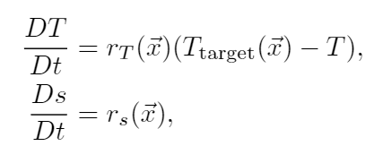
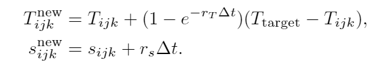
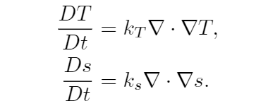
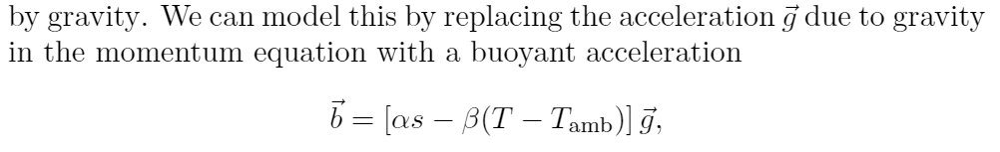
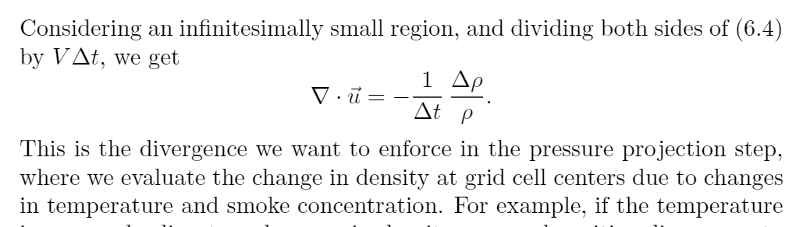

<!-- more -->

# Smoke

# Temperature and Smoke concentration.

Standard paper: Fluid_Simulation_for_Computer_Graphics_Second_Edition optimized-medium-res.pdf - p112 - the standard reference papers by Foster and Metaxas [FM97] and by Fedkiw et al. [FSJ01], with some additional capabilities added

Two extra fluid variables:

1. Temperature $T%$​
2. Concentration $s$​

> Fluid_Simulation_for_Computer_Graphics_Second_Edition optimized-medium-res.pdf - p112 - two extra fluid variables: the temperature T of the air and the concentration s of smoke particles—what we actually can see

Use Material Derivative to describe: For normal cell, with no Source Term.

$$
DT/Dt = Ds / Dt = 0
$$

> Fluid_Simulation_for_Computer_Graphics_Second_Edition optimized-medium-res.pdf - p112 - This gives us the simplest possible equations

源的处理：
​​

​​

Diffusion of Heat and concentration:

Fluid_Simulation_for_Computer_Graphics_Second_Edition optimized-medium-res.pdf - p113 - Heat and smoke concentration both can diffuse as well

​​

# Bouyancy

Fluid_Simulation_for_Computer_Graphics_Second_Edition optimized-medium-res.pdf - p115 - simplified buoyancy model commonly used in graphics.

Fluid_Simulation_for_Computer_Graphics_Second_Edition optimized-medium-res.pdf - p115 - Formula​  
​​

# Variable Density Solves

$$
\rho_\text{air} = P/RT
$$

如果认为$P$是可以变的，那么也就说明了 $\rho$ 是可变的，是一种可压缩的流体模型：Fluid_Simulation_for_Computer_Graphics_Second_Edition optimized-medium-res.pdf - p116 - as otherwise we end up in a significantly more complicated compressible flow model

$$
\rho = (1-s)\rho_{air} + s\rho_{soot} = \rho_{air} (1 + \alpha s)
$$

误差：烟灰是没有“膨胀”的。Fluid_Simulation_for_Computer_Graphics_Second_Edition optimized-medium-res.pdf - p116 - the soot has the same thermal expansion as the air. This is of course false, but we consider this error negligible relative to other modeling errors.

Fluid_Simulation_for_Computer_Graphics_Second_Edition optimized-medium-res.pdf - p118 - 根据不同的 rho 来确定 Poisson 方程的右端项  
​​

‍
