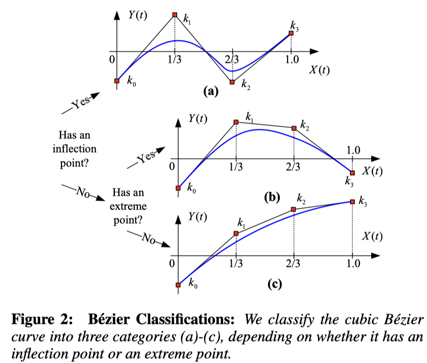

# 算法对比

Collision Detection 整理5 – CCD 算法对比

准确说，这篇blog是一篇论文的整理emmm，但由于老板的任务就是做 collsion 的汇总，这篇论文的涉及面也算是相对 Broad 的了。

论文主要用了：

1. IRF：interval-root-finder
2. UIRF：Unifromed-Interval-Root-Finder
3. FPRF：floating-point time-of-impact root finder
4. TightCCD(TCCD)
5. Root Parity(RP)
6. Rational implementation of RP
7. MSRF：minimum seperation floating-point time-of-impact root finder

## 预备知识

首先论文对于 CCD 的数学背景进行了简要的介绍：考虑三角网格，每一个时间步长内都以线性轨迹运动。那么CCD可以简化为VT和EE检查。

### Multivariate CCD Formulation

最简单的方法是直接对于CCD条件参数化，转化为关于 $u,v,t$ 的方程求解即可。

### Univariate CCD 单变量CCD

实际上上面一种求解方法一步到位解出了 $u,v,t$ 但没有注意到在接触时，四点共面的事实，所以，在[Provot 97] 中，改为先求解三次方程，然后检查是否满足条件的问题

## 方法介绍

### IRF

类似于计算 Minkowski 差，逐个检查原点在哪一个时间片中，并迭代缩小时间片。

优点：

1. 保守估计，每一步都保证包含 $0$，所以能够确保检查到碰撞
2. 通过改变时间片的允许最小大小，来改变算法的精度和速度

缺点：

1. 基于二分查找 — 慢
2. 难以实施编译优化

### UIRF

差不多的思路，但是是用二分法求的是单变量的方程根。

> 由于可能出现无穷多个根，所以这个算法必须在定义遇上按最大分辨率逐个检查，从而产生大量的计算浪费。
>
> 与此同时，它不能满足控制求解器的运行精度

### FPRF

> Robust treatment of simultaneous collisions.

主要问题：

1. FN太多，即有很多碰撞点不被检测到。
2. 当平行时无法处理 EE 的情况。

优点：

1. 速度

### TightCCD

老朋友了，还是用了单变量的求解，观察三次方程特征来减少计算。

优点：

1. 速度快
2. 完全没有检测不出的点

问题：

1. 为了 FN == 0，牺牲了 FP
2. 如果图元在同一平面上移动，它总是检测到碰撞，而与它们的相对位置无关。

### RP / RRP

转化为光线投射问题：设 $\partial \Omega$ 是其边界，通过从原点射出射线，通过观察交点在射线上的位置来判断是否发生碰撞。

问题：

1. 实际上只能做DCD – 小TS
2. 容易出现漏报的问题：在 $[t,t+\Delta t]$ 内有 2 解

原理：

> 根据 Brouwer topological degree theory：
>
> 假设 $\Omega$ 是一个 $n$ 多面体，设 $F:\Omega \rarr \mathbb R^{n}$满足 $C^2$，且有有限多个根，且没有在边界$\Gamma=\partial \Omega$ 上的根，在每一个根处的 Jacobian 都非奇异，则若有光线从 $0$ 出发，记交点数为 $q$ ，$F$ 在交点处光滑且不相切于光线，那么 $p,q$ 有相同的奇偶性。

从而得出：对于一个封闭的曲面，一条（起点在外部）射线只能穿过该曲面偶数次（切点算两次）

### BSC

> Fast and exact continuous collision detection with bernstein sign classification

通过分解为Bernstein多项式（n=3）来加速CCD。当且仅当其都在拐点同一侧有效，（需要二分求解）

缺点：

1. False Positive + False Negative

> 实际上这个思路和我一开始想的是几乎一致的：
>
> 既然这是一个三次函数，理论上讲也就四个参数，那么我对于整个区间采样四次，一定能确定这四个参数。但反过来想，确定参数是不能解决问题。因为我们的目标是给出是否在这个时间区间之内有根。
>
> 我们在高中时就已经经常做一种题，研究的就是三次函数在几个采样点处的值，然后通过这几个值来确定三次函数的一些性质。一个直观的理解是，通过四个等距采样点上的三次函数值直接判断三次函数是否有解！

原理上：给定一个三次函数 $Y(t)$ 用伯恩斯坦多项式唯一分解，对应了一个三次贝塞尔曲线，而每一个三次贝塞尔曲线可以被分类为

## 其他思路

### Bridson 2009

添加一个时间维度，通过在四维空间中的相交检测来实现碰撞检测。

问题：

1. 不直观、不常用
2. 导致了 FP 的出现 — 平行的两个三角形认定为碰撞。
