# 综合

## 碰撞处理简述

碰撞处理的难度是不大的，主要问题是如何进行快速、准确的碰撞检测。碰撞检测主要算法执行流程如下图：

## 碰撞检测 -- Introduction

首先再次引一下 PhyX 里面的内容，这也是这篇文章整体的一个思路。

> **Overview of Collision in PhysX**
>
> - Broad Phase
>   - AABB vs AABB, 3 axis sweep and prune
> - Mid Phase
>   - AABB tree vs (AABB, OBB, sphere,capsule,plane, ray) – OPCODE AABB tree
>
> 对于 Narrow Phase：
>
> - 流体-SPH Fluids (CCD)
>
>   - Particles vs static triangle mesh • Particles vs dynamic primitives
> - 布料-Cloth (CCD)
>
>   - Vertices vs static triangle mesh • Vertices vs dynamic primitives
> - 刚体-Rigid body (Discrete) – GJK or SAT
>
>   - Convex mesh and primitives vs static triangle mesh
>   - Convex, primitives vs Convex, primitives

解释一些事情：

1. 对于**大多数**情况下的碰撞，我们只考虑**物体之间**的情况，而不是物体内部。
2. Broad-Phase做的实际上是*生成式*的，而非*筛选式*的，Mid-Phase对于Broad-Phase进行筛选，Narrow-Phase是筛选结果来精确计算是否真正发生了碰撞。

   > 很多研究认为 Narrow-Phase 的效率并不需要太多考虑，而前两个筛选的效率大大影响了结果
   >
3. 对于Narrow-Phase中的三类物体，它们有不同的属性：

   1. 流体 -- SPH模拟假设为一个个小的水块，自相交检测策略不同
   2. 布料 -- Mass-Spring or PBD，约束为任何物体不能穿透布料表面，也适用于自身，所以需要进行自碰撞处理
   3. 刚体 -- 不可能发生自碰撞，只考虑物体之间的碰撞。

## Broad-Phase

实际上这个没啥好讲的，主要思路就是建立空间数据结构，然后加速计算。

1. BVHs
2. Spatial Hashing

### 加速结构

就如之前提到的，Broad-Phase主要是使用**空间数据结构**来加速碰撞检查，这类数据结构按照欧氏空间的坐标来对于整个空间进行索引加速，从而实现快速查找近邻的目的。

#### OCT-tree/kdTree

- **八叉树**：将一个Box按照点$P$和经过$P$平行于$xOy,yOz,zOx$的平面划分。
- **kd树**：每一次选择一个超平面划分所有点，超平面的选择依照$xOy, yOz, zOx,xOy,yOz,\cdots$的顺序选择。

可能碰撞转化为查询轨迹和物体是否相交，等价于查询是否和当前节点的覆盖范围相交，若检查到轨迹和结点覆盖范围

1. 相交：
   - 叶子节点，认定为可能碰撞的目标
   - 非叶结点，继续递归查询
2. 不相交： 停止递归查询

这样构造层次结构的问题是：

1. 过于规则：容易出现不均匀分割，从而导致内存浪费和查询效率下降。
2. 不利于并行计算—这也是层次结构的通病

#### BVH

BVH可以看作是OCT-Tree和kdTree的一个推广：Bounding Volumn Hierarchy（BVH） 将全空间进行划分，对于维度为 1 的情况，BVH与*线段树*几乎没有区别。不过，BVH和OCT-Tree等的最大的区别在于 OCT-Tree 和 kdTree进行划分时使用的是边界去切分整个平面，而BVH用的是**有限体积的“框”**去做空间细分。典型的BVH包括：

- AABB：轴对齐包围盒
- OBB：旋转包围盒
- kDOP：k边形包围盒
- Bounding Sphere：包围球

可以看出，各个算法不同的部分是选用的“框”的形状。另外，在构造上BVH有启发算法，可以是的其构造的层次结构尽量均匀，进一步提高BVH的加速能力。

#### Spatial Hashing / Spatial Partitioning

Spatial Hashing 的思想是为每一个空间一个编号。最简单的方法是均匀的使用格点来对于全空间进行划分。最基础的 Spatial Hashing 在为每一个格子建立列表，列表中存放所有和该格子有重合区域的物体（即一个物体可能出现在多个格子内），在查询碰撞时即对于同一列表中的不同物体进行查询即可。

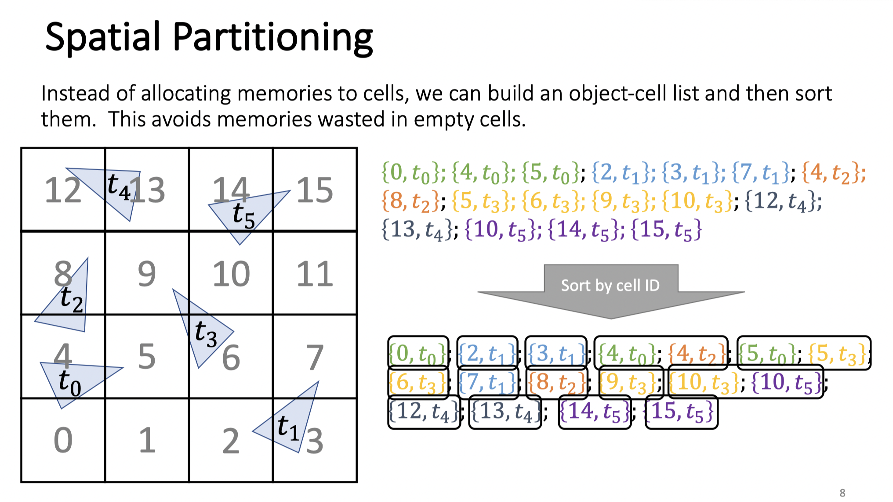

如图所示，其将全空间划分为16个格子。考虑到减少空间浪费的问题，将这些物体的按id进行排序，即可在不为每一个id建立表格的情况下完成筛选。

该算法的主要问题在于，现代的渲染常常物体、面元分布极不均匀，在可能在几个小的cell中包含大量物体，而产生大量的可能碰撞物体对，极大的降低了其查询效率。

但是得益于其可以轻松在并行计算环境，特别是GPU上进行实现，其在物理引擎中也得到了广泛的应用。

### Mid-Phase

之所以把Mid-Phase放在BroadPhase中是因为它用的算法和数据结构实际上和BroadPhase几乎是一致的。

Mid-Phase会对Broad-Phase筛选出的pair进行进一步筛选，针对每一个物体，其通过细分为更小的物体块（如凸包，面元组等），然后继续应用加速结构进行筛选。

> 在这个的基础上还有一些 local 的加速方法，但这也不能算是 Broad-Phase 的方法，因为这个方法针对于 *Deformed* 的物体进行计算的效率较高。这些方法在曲面上进行划分，相当于在曲面上定义了一个空间划分。比如通过形变能量来指导在其上的空间划分，最后精细化求解使用三次方程法求解。例如：该论文提出，可以依照形变能量，在曲面的表面上建立BVH，来指导Culling进行。

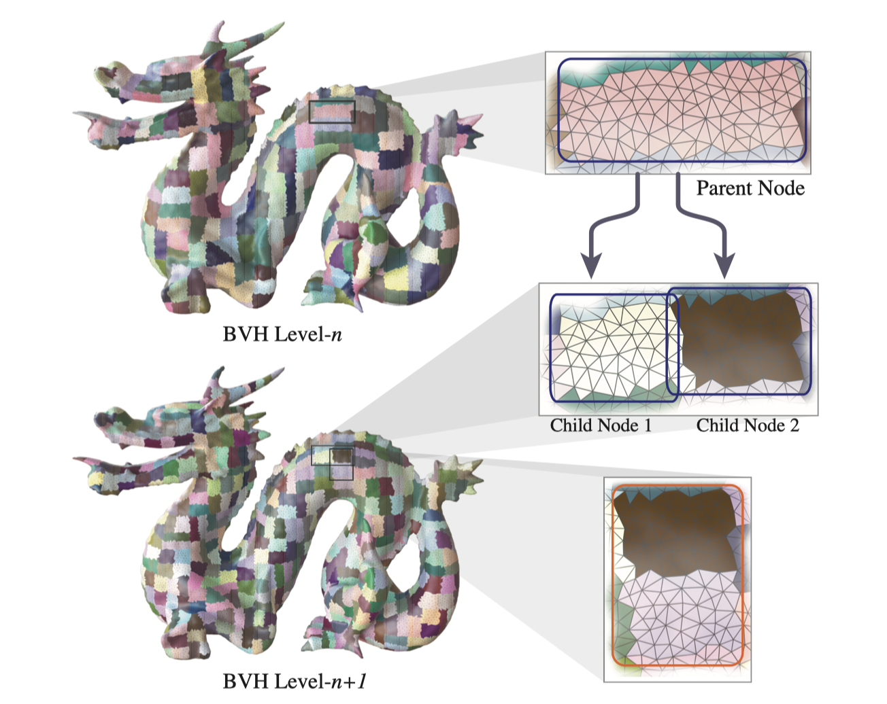

## Narrow-phase 1 刚体

### DCD

#### Signed Distance Function

如果我们能为刚体定义一个连续函数，使得对于$\mathbf x \in \Omega -\partial \Omega$有$\phi(\mathbf x) &lt; 0$对于所有$x\not \in \overline \Omega$，有$\phi(x) &gt; 0$，则可以很简单的通过函数零点的存在性来判断是否碰撞。

但对于一般的网格，难以定义这样一个带符号的距离函数。

#### 凸包/刚体的DCD计算

对于一般的刚体之间的碰撞检测，一般采用分解为凸包的算法来进行精准的碰撞检测。因此，最基础的针对凸物体的碰撞检测算法（即凸物体之间的碰撞检测）

##### GJK算法

###### Idea

设$\mathcal A = \{\mathbf x\}$，$\mathcal B = \{\mathbf x\}$是两个凸集，定义其 Minkowski 差为：

$$
\mathcal A - \mathcal B :=\{\mathbf x_1 - \mathbf x_2| \mathbf x_1 \in \mathcal A, \mathbf x_2 \in \mathcal B \}
$$

不难证明，$\mathcal A$和$\mathcal B$碰撞，当且仅当$0 \in \mathcal A - \mathcal B$。

问题在于，我们不可能遍历所有的点对来判断原点是否属于该集合。但是基于这样的基本思路，对于**凸物体**，我们可以有快速算法实现。

###### Support 函数和 Simplex 单纯形

其实我们要判断原点是否属于 Minkowski 差，就是要判断是否 Minkowski 差的一个子集包含了$0$，这样的操作可以在物体是凸的的时候要求其形成的单纯形。对于二维的情况，使用三角形；对于三维情况，使用四面体。

为了生成这样的单纯形，我们计算 support 函数来快速获取给定方向上的支撑点，如图所示[^1]。

###### 迭代求解

有了如上的论述，我们可以通过如此构造单纯形：

1. 随机生成一个单纯形
2. 假定当前的单纯形为$\{v\}$则选择距离原点最远的抛弃，对于 n - 1 维单纯形求法向量，求support（两个）
3. 直到
   1. 检查到 0 => 碰撞
   2. 如果新的support点，在迭代方向上的投影小于等于0 => 不碰撞

可以证明，这样的算法一定在有限步内结束。

##### SAT算法

一个更朴素的思想是：（类似于SVM）两个凸集合不交，当且仅当存在一个$n - 1$维的超平面能够完全分开这两个凸集合。 遍历所有的边（三维则是面），投影到其正交补空间上。若**存在**一个边，能使得投影完全分离，则其是不相交的，反之相交。具体实现为遍历所有的边来进行判断。

##### 凸包分解和碰撞检测

对于一般的刚体，我们可以选择使用**凸包分解（V-HACD）**，将刚体“拆分”成小的凸包。并使用适用于凸包的 Collision Detect 来进行碰撞的判断。

### CCD

刚体的CCD算法大致有如下几类：

1. 求解代数方程
2. 滑动体积法（Swept Volume）
3. 二分搜索
4. Conservative Advancement
   上述大部分都难以处理一般的多面体情况。但也有一些特殊情况。

<!-- 也可以使用分离轴定理计算CCD -->

#### 代数方程求解

这种方法仅适用于简单而特殊的情况，例如[Ref](Survey/http://www.realtimerendering.com/intersections.html)：

1. 光线
2. 平面
3. 球体、圆柱、圆锥、视锥
4. AABB、OBB、kDOP
5. 凸包

#### “近似CCD”

通过减小模拟的时间步长，可以将 DCD 近似为 CCD。

#### 二分搜索

这个方法仅仅用于确定 TOI

物理模拟中有时会使用二分法（二分搜索）来查找撞击时间：使用这种方案，可以非常快速地到达撞击时间，但我们不涉及Tunnel问题，因为如果在第 i 帧和第 i + 1 帧没有碰撞，二分就不会开始。

#### Swept Volumn

考察$t$和$t+1$时刻物体对应点连线（按物体形状、沿直线执行扫描）构成的体积区域，不难发现，如果有相交，则可能会出现碰撞。计算TOI（碰撞时间）后将物体移动到改时间，执行碰撞处理（如计算速度等）然后重新扫描。

在物体角速度很大的情况下会产生不精确的结果 [Ref](Survey/https://docs.unity3d.com/Manual/ContinuousCollisionDetection.html)：

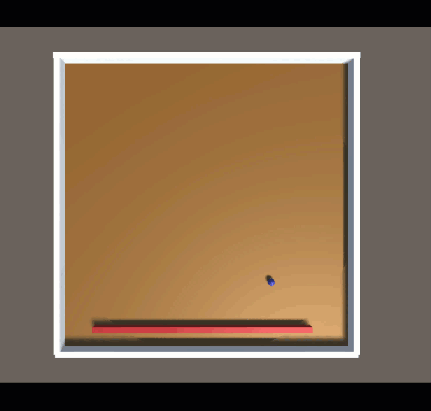

#### Speculative CCD

Speculative CCD 的工作原理是根据物体的速度和角速度，计算物体的AABB，从而推测出下一个物理步骤中所有潜在的接触。然后将所有可能接触送入求解器，以确保满足所有接触约束，以便对象不会通过任何穿模（Tunnel）的情况。求解器使用速度、体积来精确计算CCD。

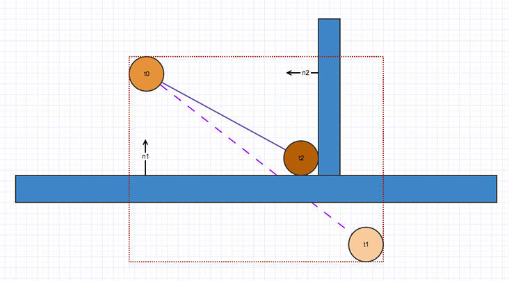

但该方法并不能完全解决所有碰撞问题。考虑如下的情况，小球因为被杆击打而获得更大的速度，先前计算的AABB并不能检测到这样的速度变化：

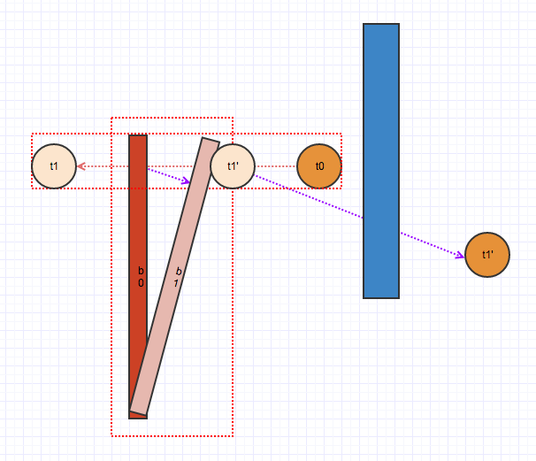

#### Ray-cast

小而高速和大而低速物体之间的碰撞检测中可以视作光投射到低速物体上的过程，该方法在 Unreal Engine 中被作为试验性功能提供（支持GPU加速）。算法将光线从对象中心点投射到低速物体上，在高速物体中放置更多的采样点并投射出多条光线，可以获得更好的结果。缺点在于，由于假设了其速度差距极大，该方法不适合计算两个运动的物体的碰撞检测。

#### Conservasive Advancement

> Ref:
>
> 1. C^2^A: Controlled Conservative Advancement for Continuous Collision Detection of Polygonal Models

在每次迭代中，计算两个对象的最近点（例如使用 GJK）。使用此信息，计算对象可以在避免碰撞的同时移动的安全距离。仅经过几次迭代，就可以找到影响时间。

## Narrow-Phase 2 变形体

### DCD

DCD检查的是如下的方程的解的问题（考察 V-E)：

$$
\begin{cases}
   \left( ((1-t)\mathbf{x}_a + t \mathbf x _ b - \mathbf x_0 ) \quad \mathbf x _{10} \quad x_{20}\right) = 0\\
   t = (\mathbf x_{0a} \mathbf x_{10}\mathbf  x_{20}) / (\mathbf x_{ba} \mathbf 
   x_{10} \mathbf x_{20})\\
   t \in [0, 1]\\
   \mathbf x(t) \text{ inside } \triangle
\end{cases}
$$

分为三步求解：

1. 求解前两行的方程
2. 判断$t$是否在$[0, 1]$
3. 判断$\mathbf x(t)$是否在三角形内

这一部分基本很少有人做，原因在于现代的模拟算法越来越追求计算效率，使用较大的时间步长来进行模拟计算。若仅仅使用DCD，容易产生“穿模”的问题。

### CCD

对于变形体（主要是三角网格）的连续碰撞检测处理算法研究主体还是对于三次方程（即VT/EE条件求解），同时也借鉴了一些在刚体碰撞检测中常用的技巧：

1. 二分法
   1. IRF：interval-root-finder
   2. UIRF：Unifromed-Interval-Root-Finder
2. （针对三角网格）求解三次方程：
   1. FPRF：floating-point time-of-impact root finder
   2. TightCCD(TCCD)
   3. BSC
3. 光线投射
   1. Root Parity(RP)
   2. Rational implementation of RP （RRP）
4. 分割空间微元

#### Preliminaries

沿用IPC中的记号。对于碰撞检测而言，最基本的模型是假设其在两个迭代步骤之间是线性的，即

$$
\mathbf x(t) = t \cdot \mathbf x ^{i + 1}  + (1 - t) \cdot \mathbf x ^{i}
$$

其中：

-$t$为归一化后的时间，即$t = (t - t_{i}) / (t_{i + 1} - t _i )$其中右侧的$t$是模拟运行时间
-$\mathbf x$是坐标，是关于时间的函数。上标表示迭代代数

为了简单期间，用$\mathcal A = \mathbf x_1\cdots \mathbf x_i$来表示一个$n$维单纯形，用$\mathbf x_{ij}$来表示$\mathbf x_{i} - \mathbf x_{j}$。

在这样的记号下，碰撞可以用$t$来描述，即：

单纯形$\mathcal A = \{\mathbf x_1 \cdots\mathbf x_n\}$和$\mathcal B = \{\mathbf x_1 \cdots \mathbf x_m\}$碰撞，当且仅当：

$$
\exists t\in[0, 1]\quad s.t. \  \mathcal A(t) \cap \mathcal B(t) \ne \emptyset
$$

这个公式仅仅是一个定义，并没有很大的计算价值，因此我们需要对于这样的问题进行适当的简化。主要有几种思路：

1. 二分搜索，找可能的碰撞时间$t$
2. 约束为三角网格再：
   1. 求解重心坐标$(u,v)$和$t$
   2. 简化为三次方程求根
3. 光线投射方法

#### 二分法

##### IRF

> Ref:
>
> 1. Interval Analysis For Computer Graphics
> 2. Interval Methods for Multi-Point Collisions between Time-Dependent Curved Surfaces

逐个检查原点在哪一个时间片中，并迭代缩小时间片。

优点：

1. 不会有遗漏的碰撞情况，并且每一步都保证包含 $0$，所以能够确保检查到碰撞
2. 通过改变时间片的允许最小大小，来改变算法的精度和速度

缺点：

1. 基于二分查找 — 太慢
2. 难以实施编译优化

##### UIRF

差不多的思路，但是是用二分法求的是单变量的方程根。

> 由于可能出现无穷多个根，所以这个算法必须在定义遇上按最大分辨率逐个检查，从而产生大量的计算浪费。
>
> 与此同时，它不能满足控制求解器的运行精度

#### 针对三角网格的三次方程求解方法

> Ref:
>
> 1. Collision and self-collision handling in cloth model dedicated to design garments

针对于三角网格，上文提出：

Theorem
: 碰撞发生，当且仅当至少发生以下一种碰撞：

1. Vertex-Triangle
2. Edge-Edge

在这篇论文中，还提出了这两类条件的符号语言描述：

$$
VT\iff \exists t\in [0, 1]\quad \begin{cases}
\left(\mathbf x_{12} \mathbf x_{13}\mathbf x_{14}\right) = 0\\
\mathbf x_4 \in \left\{ x_1 x_2 x_3 \right\}
\end{cases}
$$

其中：$1,2,3$为三角形顶点，$4$为顶点

$$
EE\iff \exists t\in [0, 1] \quad \begin{cases}
\left(\mathbf x_{12} \mathbf x_{13}\mathbf x_{14}\right) = 0\\
\left\{\mathbf x_1 \mathbf x_2\right\} \cap \left\{\mathbf x_3 \mathbf x_4\right\} \ne \emptyset
\end{cases}
$$

对于上述两种做法，我们观察到条件中都有一个关于$t$的三次方程（因为每一个$\mathbf x_i$都是关于$t$仿射），因此我们的解决思路就是：

1. 求三次方程在$[0, 1]$内的根
2. 检查这个根是否满足第二个条件

其中的**数值精度**问题体现在：

1. 三次方程求解：
   1. 不能使用求根公式（误差放大几个数量级） -- 只能用牛顿法求
   2. 何时停止迭代
2. 判断是否碰撞时的误差上界？

##### FPRF

最老、最经典的一篇论文

> Ref:
>
> 1. Collision and self-collision handling in cloth model dedicated to design garments

思想：解三次方程，解出来的解对应函数值是小于一常数，则判断为碰撞。

主要问题：

1. FN太多，即有很多碰撞点不被检测到。
2. 当平行时无法处理 EE 的情况。

优点：

1. 速度

##### TightCCD

> Ref:
>
> 1. TightCCD: Efficient and Robust Continuous Collision Detection using Tight Error Bounds

老朋友了，还是用了单变量的求解，观察三次方程特征来减少计算，观察的是

$$
Y(0),Y'(0),Y'(1),Y''(0),Y''(1)
$$

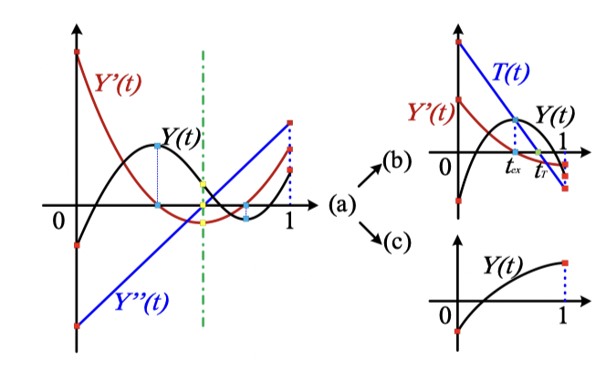

优点：

1. 速度快，准确率也高，几乎是最好的算法
2. 完全没有检测不出的碰撞

问题：

1. 为了 FN == 0，牺牲了 FP
2. 如果图元在同一平面上移动，它总是检测到碰撞，而与它们的相对位置无关。

##### BSC

> Ref:
>
> 1. Fast and exact continuous collision detection with bernstein sign classification

通过分解为Bernstein多项式（n=3）来加速CCD。当且仅当其都在拐点同一侧有效，（需要二分求解）

缺点：

1. False Positive + False Negative

> 实际上这两个思路和我一开始想的是一致的：
>
> 既然这是一个三次函数，理论上讲也就四个参数，那么我对于整个区间采样四次，一定能确定这四个参数。但反过来想，确定参数是不能解决问题。因为我们的目标是给出是否在这个时间区间之内有根。
>
> 我们在高中时就已经经常做一种题，研究的就是三次函数在几个采样点处的值，然后通过这几个值来确定三次函数的一些性质。一个直观的理解是，通过四个等距采样点上的三次函数值直接判断三次函数是否有解！

原理上：给定一个三次函数 $Y(t)$ 用伯恩斯坦多项式唯一分解，对应了一个三次贝塞尔曲线，而每一个三次贝塞尔曲线可以被分类为

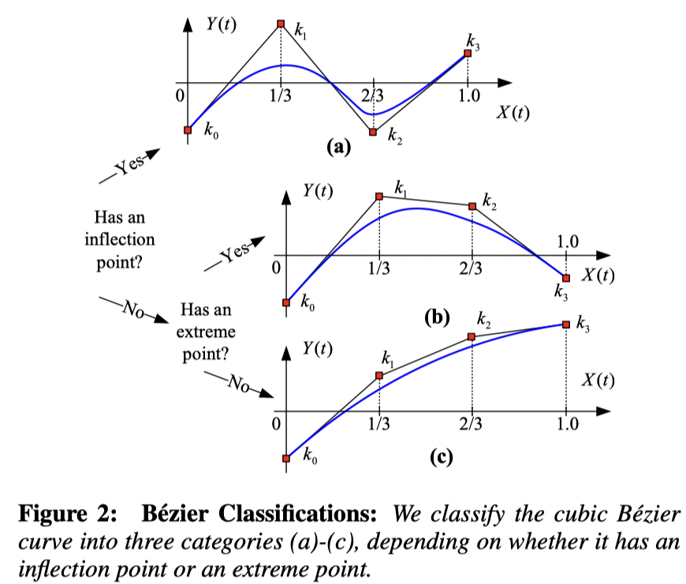

从而通过观察：

$$
Y(0), Y(1/3), Y(2/3), Y(1)
$$

（其中 $Y$ 即为三次方程对应的函数）的值来减少计算开销并提升精度。

#### 光线投射 RP / RRP

转化为光线投射问题：设 $\partial \Omega$ 是其边界，通过从原点射出射线，通过观察交点在射线上的位置来判断是否发生碰撞。

问题：

1. 实际上只能做DCD – 小TS
2. 容易出现漏报的问题：在 $[t,t+\Delta t]$ 内有 2 解

原理：

> 根据 Brouwer topological degree theory：
>
> 假设 $\Omega$ 是一个 $n$ 多面体，设 $F:\Omega \rightarrow \mathbb R^{n}$满足 $C^2$，且有有限多个根，且没有在边界$\Gamma=\partial \Omega$ 上的根，在每一个根处的 Jacobian 都非奇异，则若有光线从 $0$ 出发，记交点数为 $q$ ，$F$ 在交点处光滑且不相切于光线，那么 $p,q$ 有相同的奇偶性。

从而得出：对于一个封闭的曲面，一条（起点在外部）射线只能穿过该曲面偶数次（切点算两次）

### 碰撞处理

> 在这里假设在上一步已经获取了碰撞的时刻（TOI）
>
> Ref:
>
> 1. Robust Treatment of Collisions, Contact and Friction for Cloth Animation

根据王老师在GAMES103和2021图形学大会讲的内容（Real-Time Cloth Simulation on GPUs），其程序流程如下：

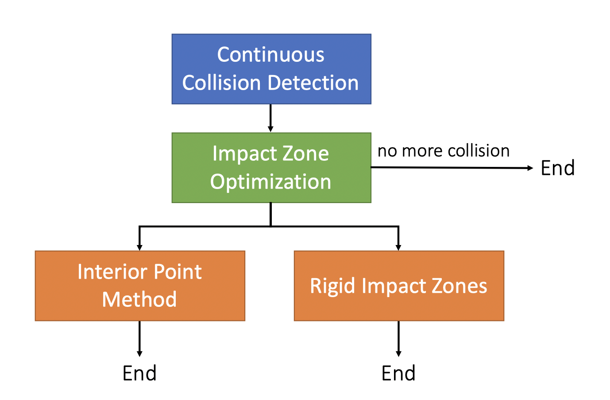

前两种方法都是基于如下公式：

$$
\mathbf x^{k+1} = \arg\min \|\mathbf x - \mathbf x ^ *\|
$$

而Untangle Cloth不基于上式直接进行解除相交问题。

#### Interior Point Method 内点法

思想：添加$\log$边界函数，保持在可行域内，逐步迭代：

优点

- Always succeed

缺点：

- 可能达到局部最优解
- 需要计算所有的顶点来迭代
- 小步长 — 速度慢

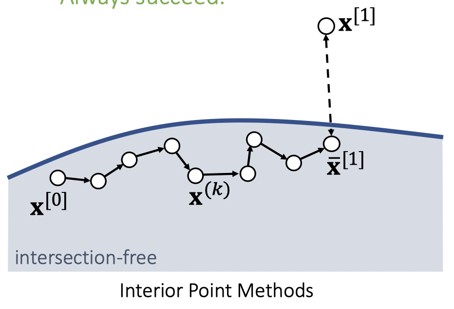

#### Impact Zone Optimization

思想：直接从 $\mathbf x^*$ 开始迭代，逐步逼进可行域，如下图

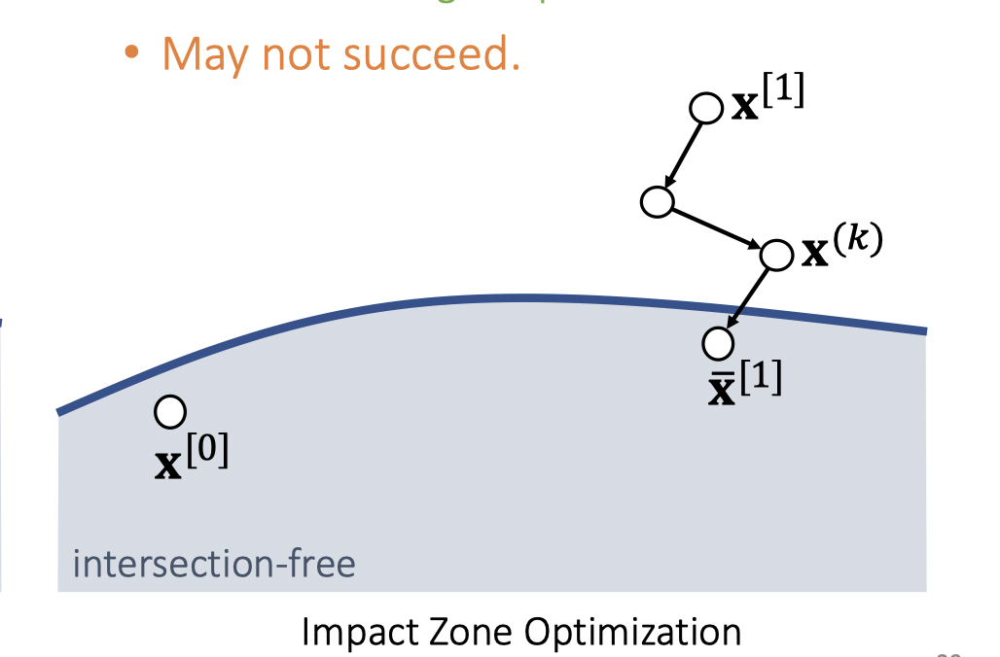

优点：

- 很容易得到一个可能的解。
- 只需要对不满足约束的点处理
- 可以使用大步长

缺点：

- 可能不收敛到可行域内

#### 相交解除 — Untangle Cloth

> Ref
>
> 1. Untangle Cloth
> 2. Resolving Surface Collisions through Intersection Contour Minimization

当拿到碰撞点后，使用“注水”法，可以直接求出交叉的区域。对于这两个交叉的边界，假设为“紧密贴合”。

优点：

1. 保证在绝大部分情况下能够处理

缺点：

1. 原文中之处理了相交的闭区域，对于边界交叉处理不方便。
2. 物理上不真实
3. 难以在GPU上实现

#### Rigid Impact Zone

如果上述方法都失败了，那么就考虑使用该方法，其对于不满足要求的点，直接回退到上一模拟步的状态（无相交的状态）。

## 非接触方法

这一类方法都将原有的碰撞条件增强为保持一些点/面之间的距离大于一定值，从而避免 CCD 过程。正如zhihu上所说：

> 之前大家试过很多方法，比如定义物体表面距离很近的“点-三角”对和“边-边”对（接触元对）组成的四面体的有符号体积要恒大于0；或者在每个时间歩开始时，找到距离近的每个接触元对上距离最近的点对，限定这些点对的距离大于0等。这些定义的问题在于，如果物体在某个时间歩移动比较多，他们可能无法正确描述无穿透这件事。另外这类方法大多基于sequential quadratic programming优化方法，没法像无约束条件时的牛顿迭代那样方便地通过line search保证稳定收敛。
>
> By Minchen Li.

### IPC

> Ref:
>
> 1. Incremental potential contact: intersection-and inversion-free, large-deformation dynamics
> 2. Medial IPC: accelerated incremental potential contact with medial elastics
> 3. Codimensional incremental potential contact
> 4. BFEMP: Interpenetration-Free MPM-FEM Coupling with Barrier Contact

主要思路：迭代的每一步，都把所有 primitive pair 分成两类：

1. $0<\min \mathrm{distance} \le \hat d$：设置$\log$-barrier 函数，防止直接碰撞
2. $\min \mathrm{distance} &gt; \hat d$：设置迭代最大步长，避免距离在迭代路径上碰撞（穿透）

依据这两个基本假设来避免 CCD。

首先，其主要处理的是如何**避免连续碰撞检测**，在论文中，其提出：

> 我们称一个状态是可接受的，当且仅当存在一条可行路径，到达该状态，或以该状态为极限。
>
> 一个迭代路径是可接受的，当且仅当其可以作为上述的极限过程中的状态序列

$$
\mathbf x \in \Omega \iff \exists \mathbf x_i \in \Omega.\ \lim_{i\rightarrow \infty} = \mathbf x
$$

那么，基于以上假设，我们完全可以不去度量是否**产生了**碰撞，而把约束换成

$$
\|\mathbf x - \mathbf x'\| > 0,\quad \forall \mathbf x' \in \partial \Omega
$$

这样，我们可以将问题转化为：

$$
\|\mathbf x - \mathbf y\| \ge \epsilon, \forall \mathbf x ,\mathbf y\text{ from different primitives}
$$

那么，可以将动力学方程和约束放在一起求解即：

$$
\begin{aligned}
\min_{\mathbf x}\quad &F(\mathbf x) + G(\min \mathrm{distance}(\mathbf x))\\
\text{s.t.}\quad &\mathbf x \text{ is feasible}
\end{aligned}
$$

其中：

- $F$ 为动力学方程中的能量
- $G$ 为障碍函数

这是一个几乎没有约束的优化问题：因为原来的碰撞处理的全套流程转化为在迭代求解过程中，保证迭代路径是可接受的！

具体而言，Log函数为了避免在不充分接近时也出现“抵抗力”，其在保证$C^2$的情况下，构造了如下的“log-barrier”：

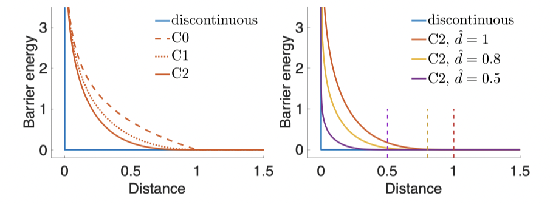

> 该方法可以看作是一个“内点法”

#### 如何计算 “距离”

IPC方法中并不限于三角网格等具体的空间结构，因此距离的计算并不需要依赖于物体表示的维数。基本思路是通过重心坐标构造两个 primitive 上的点$\mathbf x$和$\mathbf y$，从而计算

$$
d(\mathbf x, \mathbf y) = \min \|\mathbf x - \mathbf y\|
$$

来得到距离。

#### Constraint Set

通过 Spatial Hashing 算法来加速 Constraint Set 计算，定义为：

$$
\{\langle i , j \rangle | d(\mathbf x_i, \mathbf x_j) \le \hat d \}
$$

#### 迭代过程中如何保证约束

算法使用 Intersection-Aware Line-Search（回溯线搜索）来进行迭代。并且在每次执行搜索之前，重新计算 Constraint Set。而观察到对于：

1. Constraint Set 中的元素对：一定出现在优化的能量函数中，通过barrier函数避免碰撞
2. 不在其中的元素对：初始距离$&gt;\hat d$

从而可以通过 $\hat d$ 指导迭代的最大步长。

从而将原本难以解决的CCD问题避免。

#### 总结

优点：

1. 不需要繁琐的 CCD -- 速度、精度都有保证
2. 嵌入到 Dynamic Solver 迭代过程中
3. 容易在GPU上实现

缺点：

1. 非接触方法，摩擦难以解决

### SIGGRAPH 2021 -- Repulsion Method

> Ref:
>
> 1. A Safe and Fast Repulsion Method for GPU-based Cloth Self Collisions

思路：找到使不产生VT/EE碰撞的充分条件，且该充分条件仅需要考虑顶点之间的距离，而和三角网格无关。

$$
\min d(\mathbf v_i, \mathbf v_j) \ge \hat d = L / 2
$$

其中$L$为三角网格的最大边长。

求解过程分为两部分：

1. Soft-Phase
2. Hard-Phase

并且为了避免约束过强，使用了自适应的重采样方法。

#### Soft-Phase

$$
\mathbf x^{k+1} = \arg \min\left\{ \|\mathbf x − \mathbf x^{\mathrm {init}} \| − \rho \min \left\{c_{ij} (\mathbf x) − \varepsilon_{slack} , 0  \right\}\right\}
$$

#### Hard-Phase

$$
\mathbf x^{k+1} = \arg \min\left\{ \|\mathbf x − \mathbf x^{\mathrm {init}} \| − \mu \sum {
\log (f(c_{ij}(x), \varepsilon_{slack}))
}\right\}
$$

其中的 $f$ 是满足 $C^1$ 的分段函数：

$$
f = \begin{cases}
   x & x\le 0\\
   ax^3 + bx^2 + cx + d & 0 <x \le \varepsilon\\
   \varepsilon& \text{otherwise}
\end{cases}
$$

#### Adaptive Resampling

由于要求所有距离大于 $L / 2$，为了使得这个条件不是过于充分的，要求最小边长和最大边长$l$与$L$的比例大于一定值。

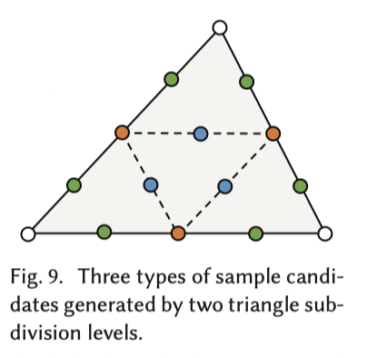
