<!-- more -->

# 空气动力学

## NS、连续介质力学

[The Lattice Boltzmann Method Principles and Practice.pdf - p26 - 连续性方程](LBM Principles and practice/The Lattice Boltzmann Method Principles and Practice-20231014203512-ry3qjqr.pdf?p=26)  
​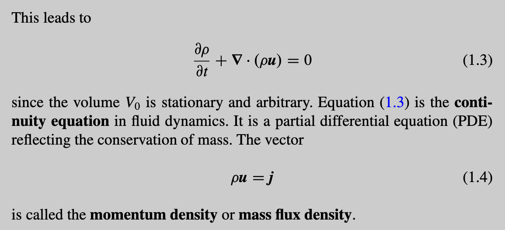​

[The Lattice Boltzmann Method Principles and Practice.pdf - p27 - the change of net momentum can be due to (i) flow of momentum into or out of the fluid element, (ii) differences in pressure p and (iii) external body forces F. ](LBM Principles and practice/The Lattice Boltzmann Method Principles and Practice-20231014203512-ry3qjqr.pdf?p=27)

[The Lattice Boltzmann Method Principles and Practice.pdf - p28 - Euler 方程：流体的动量守恒形式](LBM Principles and practice/The Lattice Boltzmann Method Principles and Practice-20231014203512-ry3qjqr.pdf?p=28)  
​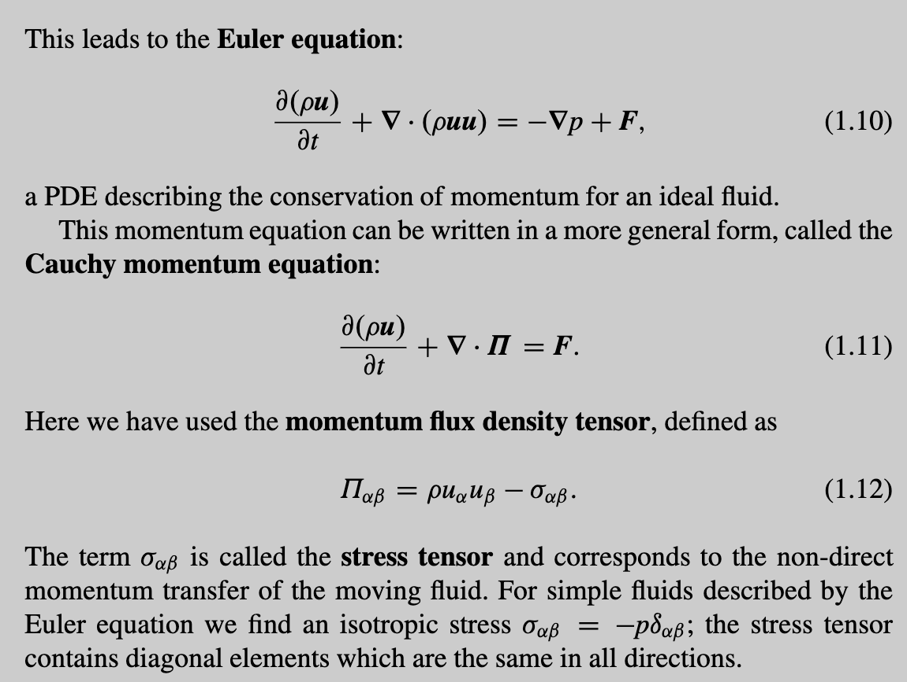​

> 流体控制方程主要是如下形式：（非守恒形式）
>
>> [Navier–Stokes equations](https://en.wikipedia.org/wiki/Navier–Stokes_equations)
>>
>
> $$
> \begin{aligned}
> \frac{\partial \vec u}{ \partial t} + \vec u \cdot \nabla \vec u + \frac 1 {\rho} \nabla p
> &= \vec g + \nu\nabla ^2 \vec u\\
> \nabla \cdot \vec u& = 0
> \end{aligned}
> $$

[The Lattice Boltzmann Method Principles and Practice.pdf - p29 - NS方程](LBM Principles and practice/The Lattice Boltzmann Method Principles and Practice-20231014203512-ry3qjqr.pdf?p=29)  
​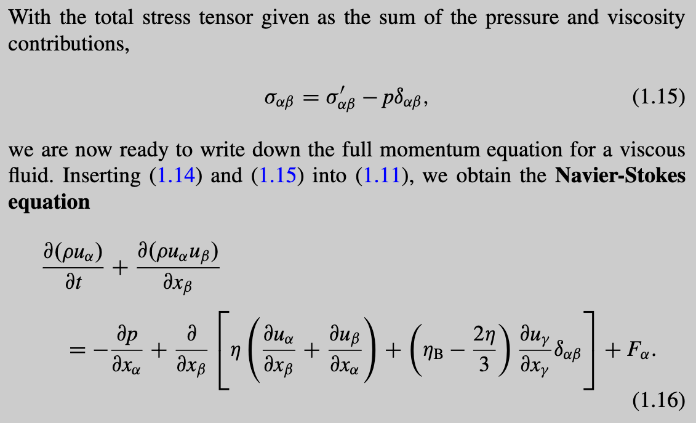​

[The Lattice Boltzmann Method Principles and Practice.pdf - p29 - 不可压缩流的NS方程（非守恒型）](LBM Principles and practice/The Lattice Boltzmann Method Principles and Practice-20231014203512-ry3qjqr.pdf?p=29)  
​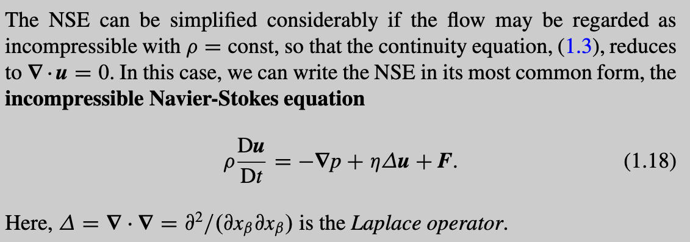​

[The Lattice Boltzmann Method Principles and Practice.pdf - p31 - 理想气体的状态方程](LBM Principles and practice/The Lattice Boltzmann Method Principles and Practice-20231014203512-ry3qjqr.pdf?p=31)  
​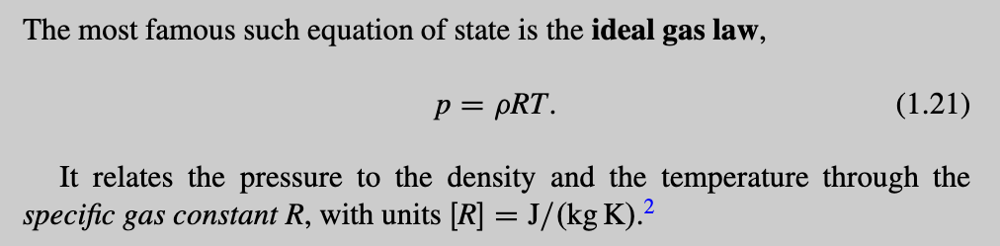​

[The Lattice Boltzmann Method Principles and Practice.pdf - p32 - 恒定压强](LBM Principles and practice/The Lattice Boltzmann Method Principles and Practice-20231014203512-ry3qjqr.pdf?p=32)  
​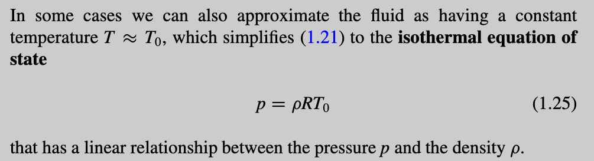​

## 动力学

### 分布函数和它的动量

[The Lattice Boltzmann Method Principles and Practice.pdf - p38 - 分布](LBM Principles and practice/The Lattice Boltzmann Method Principles and Practice-20231014203512-ry3qjqr.pdf?p=38)  
​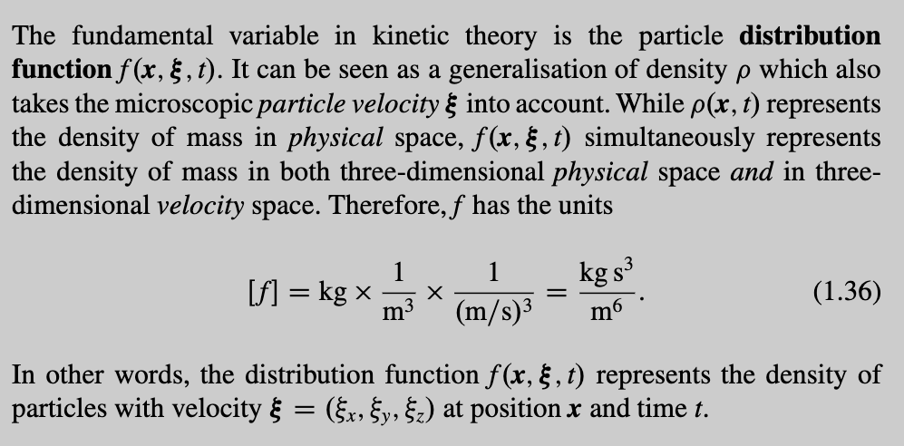​

[The Lattice Boltzmann Method Principles and Practice.pdf - p39 - 动量和质量密度，通过动量来联系](LBM Principles and practice/The Lattice Boltzmann Method Principles and Practice-20231014203512-ry3qjqr.pdf?p=39)  
​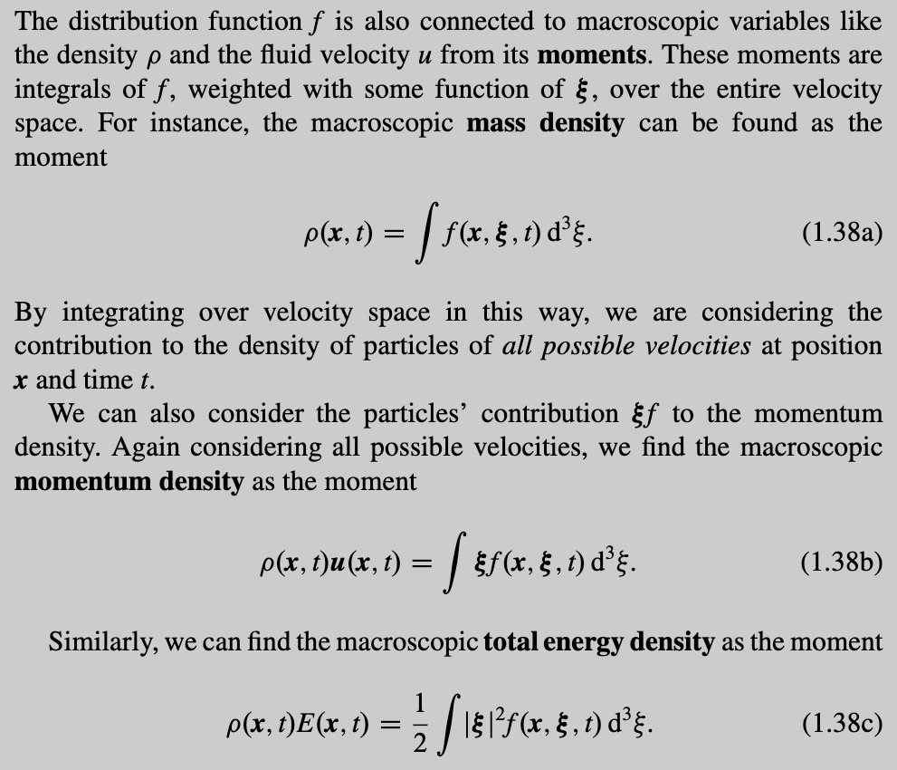​

[The Lattice Boltzmann Method Principles and Practice.pdf - p40 - The Lattice Boltzmann Method Principles and Practice-P40-20231014210700](LBM Principles and practice/The Lattice Boltzmann Method Principles and Practice-20231014203512-ry3qjqr.pdf?p=40)  
​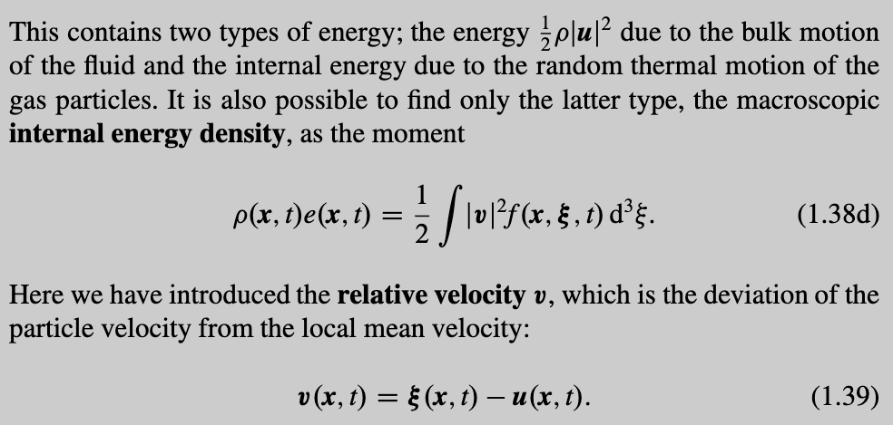​

### 稳定分布函数

[The Lattice Boltzmann Method Principles and Practice.pdf - p42 - The Lattice Boltzmann fMethod Principles and Practice-P42-20231014210732](LBM Principles and practice/The Lattice Boltzmann Method Principles and Practice-20231014203512-ry3qjqr.pdf?p=42)  
​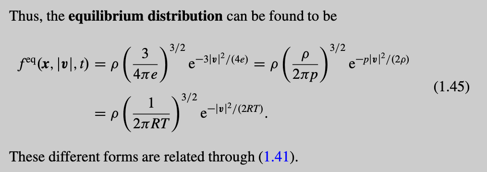​

### Boltzmann eqn and collision operator

[The Lattice Boltzmann Method Principles and Practice.pdf - p43 - The Lattice Boltzmann Method Principles and Practice-P43-20231014210927](LBM Principles and practice/The Lattice Boltzmann Method Principles and Practice-20231014203512-ry3qjqr.pdf?p=43)  
​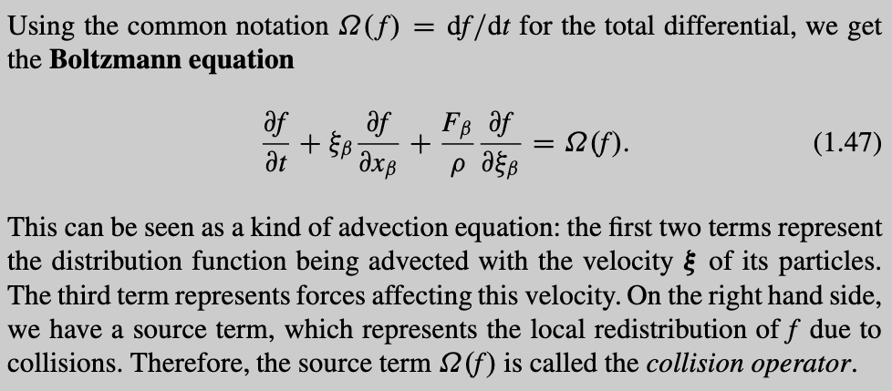​

[The Lattice Boltzmann Method Principles and Practice.pdf - p44 - 守恒律表达](LBM Principles and practice/The Lattice Boltzmann Method Principles and Practice-20231014203512-ry3qjqr.pdf?p=44)  
​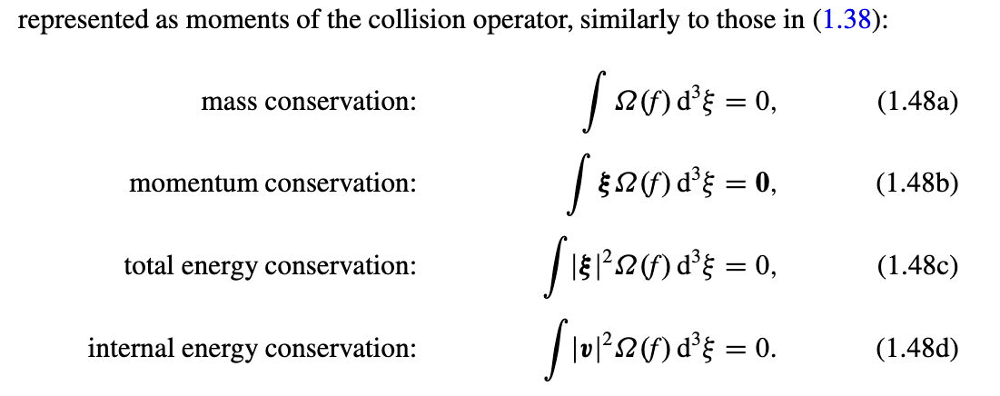​

[The Lattice Boltzmann Method Principles and Practice.pdf - p44 - BGK model](LBM Principles and practice/The Lattice Boltzmann Method Principles and Practice-20231014203512-ry3qjqr.pdf?p=44)  
​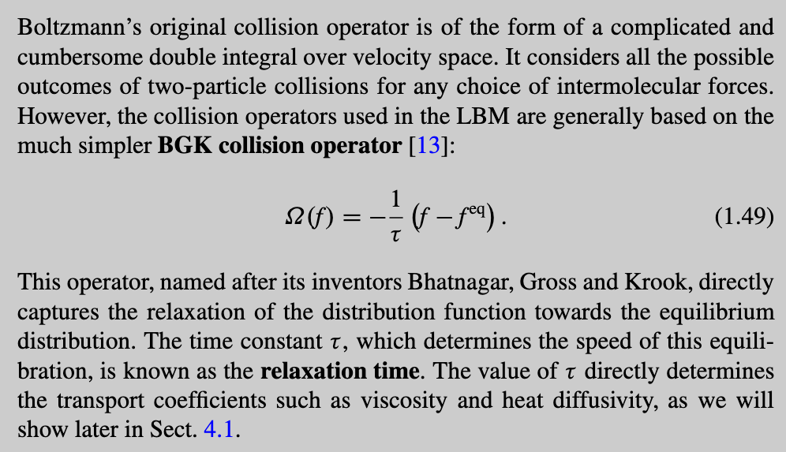​

### 宏观守恒定律

验证细节不展开了。自动满足：

1. 质量守恒：[The Lattice Boltzmann Method Principles and Practice.pdf - p46 - the collision operator’s mass conservation property](LBM Principles and practice/The Lattice Boltzmann Method Principles and Practice-20231014203512-ry3qjqr.pdf?p=46)
2. 动量守恒
3. 能量守恒

### Boltzmann Theorem

[The Lattice Boltzmann Method Principles and Practice.pdf - p49 - The Lattice Boltzmann Method Principles and Practice-P49-20231014211805](LBM Principles and practice/The Lattice Boltzmann Method Principles and Practice-20231014203512-ry3qjqr.pdf?p=49)  
​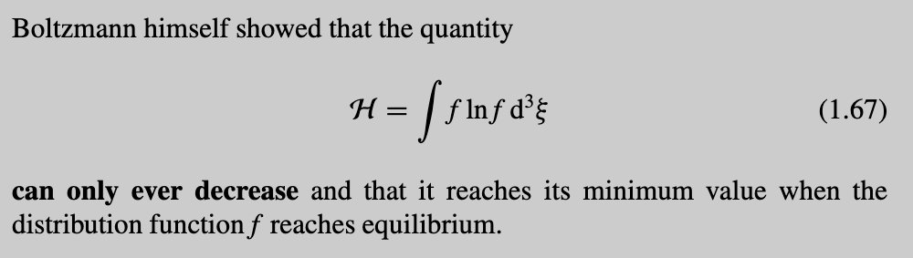​

最小化熵。

# The lattice boltzmann equation

* 之前的Boltzmann方程，描述了统计意义下的气体变化性质[The Lattice Boltzmann Method Principles and Practice.pdf - p81 - The Boltzmann equation in Sect. 1.3 describes the dynamics of a gas on amesoscopic scale. ](LBM Principles and practice/The Lattice Boltzmann Method Principles and Practice-20231014203512-ry3qjqr.pdf?p=81)
* 尽管BE比NSE更加复杂（七个变量），但如果有好的数值方法，就比nse好算。[The Lattice Boltzmann Method Principles and Practice.pdf - p82 - solve the Boltzmann equation numerically,this may also indirectly give us a solution to the NSE](LBM Principles and practice/The Lattice Boltzmann Method Principles and Practice-20231014203512-ry3qjqr.pdf?p=82)

我们还是重新强调一下Incompressible的NSE的形式：

$$
\begin{aligned}
\frac{\partial \vec u}{ \partial t} + \vec u \cdot \nabla \vec u + \frac 1 {\rho} \nabla p
&= \vec g + \nu\nabla ^2 \vec u\\
\nabla \cdot \vec u& = 0
\end{aligned}
$$

一个重要的事实是：

[The Lattice Boltzmann Method Principles and Practice.pdf - p82 - The Lattice Boltzmann Method Principles and Practice-P82-20231015101823](LBM Principles and practice/The Lattice Boltzmann Method Principles and Practice-20231014203512-ry3qjqr.pdf?p=82)  
​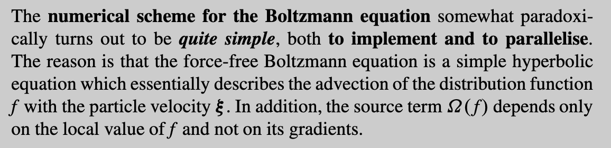​

之前的数值方法的主要缺点是，对流项很难处理

> [The Lattice Boltzmann Method Principles and Practice.pdf - p82 - A major difficulty with these methods is discretising the advection term .u  r/u;complicated iterative numerical schemes with approximation errors are introduced to deal with this.](LBM Principles and practice/The Lattice Boltzmann Method Principles and Practice-20231014203512-ry3qjqr.pdf?p=82)

## The lattice boltzmann method in a nutshell

A quick intro.

### Overview

[The Lattice Boltzmann Method Principles and Practice.pdf - p83 - 密度和动量的计算从概率密度中恢复。](LBM Principles and practice/The Lattice Boltzmann Method Principles and Practice-20231014203512-ry3qjqr.pdf?p=83)  
​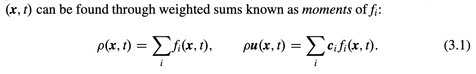​

单位可以通过一系列转化，变成“相同”的（无量纲数不变）》 

> [The Lattice Boltzmann Method Principles and Practice.pdf - p83 - another possible choice would be Imperial units. The most common choice in the LB literature, however, is lattice units, a simple artificial set of units scaled such that ĩt D 1 and ĩx D 1.](LBM Principles and practice/The Lattice Boltzmann Method Principles and Practice-20231014203512-ry3qjqr.pdf?p=83)

常用的速度集合：[The Lattice Boltzmann Method Principles and Practice.pdf - p83 - The most commonly used velocity sets to solve the Navier-Stokes equation are D1Q3, D2Q9, D3Q15, D3Q19 and D3Q27. ](LBM Principles and practice/The Lattice Boltzmann Method Principles and Practice-20231014203512-ry3qjqr.pdf?p=83)

[The Lattice Boltzmann Method Principles and Practice.pdf - p84 - Lattice Boltzmann Equation：差分](LBM Principles and practice/The Lattice Boltzmann Method Principles and Practice-20231014203512-ry3qjqr.pdf?p=84)  
​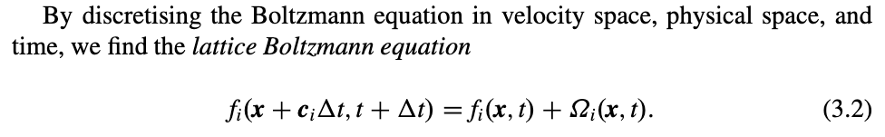​

[The Lattice Boltzmann Method Principles and Practice.pdf - p84 - BGK碰撞算子](LBM Principles and practice/The Lattice Boltzmann Method Principles and Practice-20231014203512-ry3qjqr.pdf?p=84)：注意稳定态对速度是非线性的  
​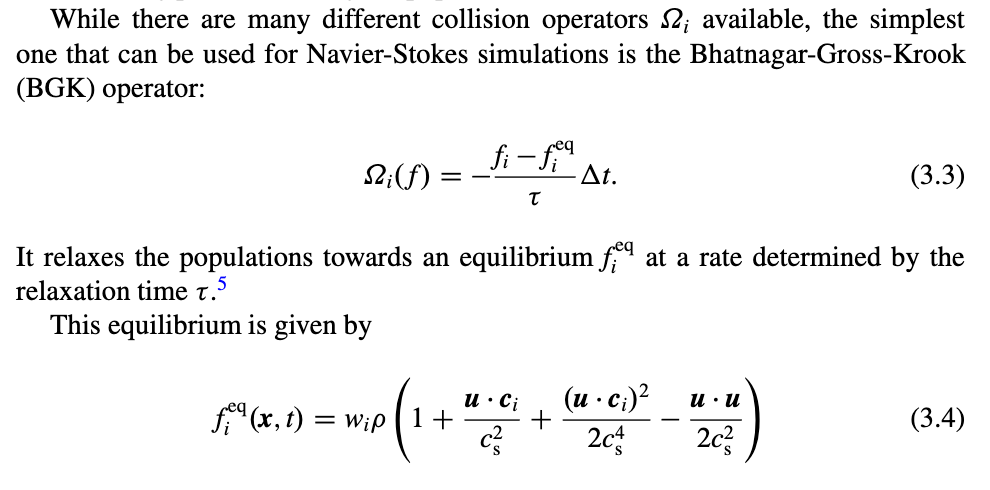​

其中的 $w_i$ 的选取和速度集合有关。

这样的$f_i^{eq}$能够保证**动量**和**质量守恒**。

如果是无粘性流体，$\Omega_i = - \frac12 (f_i - f_i^{eq})$

[The Lattice Boltzmann Method Principles and Practice.pdf - p85 - 粘性项与等式中的参数的关系](LBM Principles and practice/The Lattice Boltzmann Method Principles and Practice-20231014203512-ry3qjqr.pdf?p=85)  
​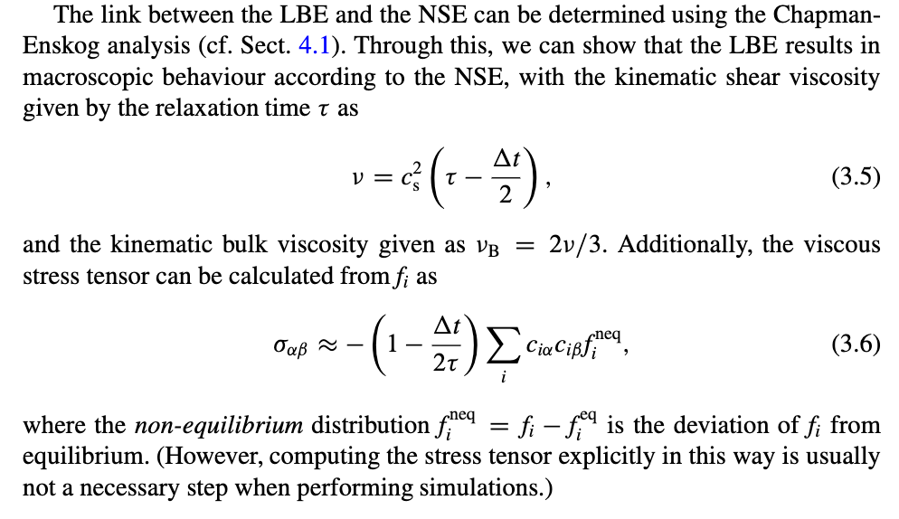​

### Time stepping

[The Lattice Boltzmann Method Principles and Practice.pdf - p85 - LatticeBoltzmann + BGK Operator ⇒ LBGK eqn](LBM Principles and practice/The Lattice Boltzmann Method Principles and Practice-20231014203512-ry3qjqr.pdf?p=85)  
​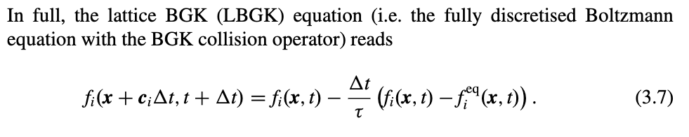​

分成两部分：

1. Relaxation/Collision
2. Propagation

[The Lattice Boltzmann Method Principles and Practice.pdf - p86 - 不考虑所有其他外界情况下，LBM的两步骤](LBM Principles and practice/The Lattice Boltzmann Method Principles and Practice-20231014203512-ry3qjqr.pdf?p=86)  
​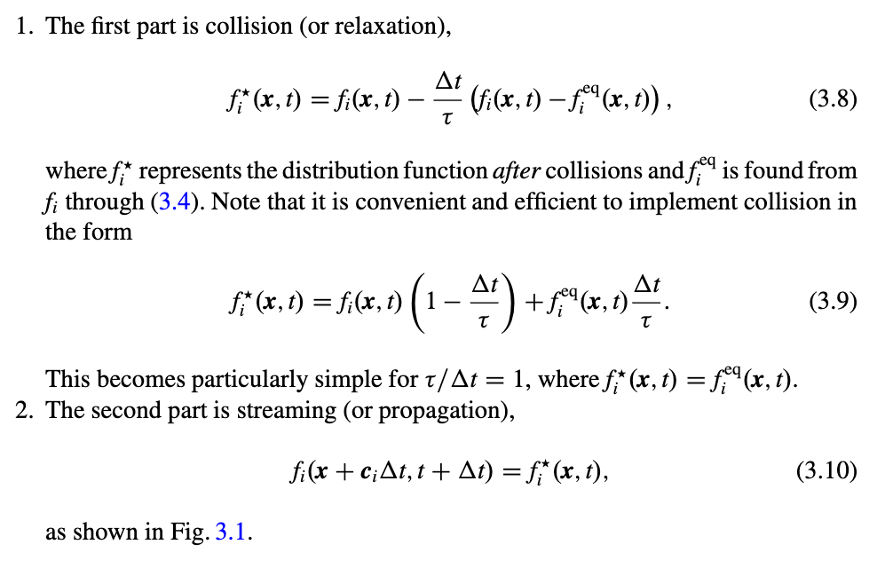​

[The Lattice Boltzmann Method Principles and Practice.pdf - p85 - The Lattice Boltzmann Method Principles and Practice-P85-20231015112638](LBM Principles and practice/The Lattice Boltzmann Method Principles and Practice-20231014203512-ry3qjqr.pdf?p=85)  
​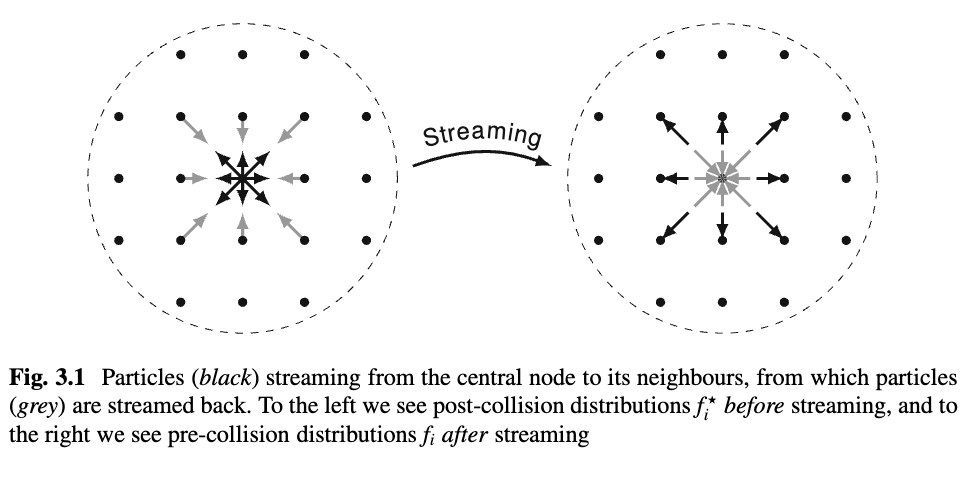​

需要注意的是：

1. collision是**局部的**​

    1. 计算密度 $\rho$​
    2. 计算宏观速度 $u$​
    3. 从而计算出平衡态的$f_i^{eq}$ ⇒ $f_i^*$
2. stream，全局更新，但是线性且简单

> [The Lattice Boltzmann Method Principles and Practice.pdf - p86 - 总结](LBM Principles and practice/The Lattice Boltzmann Method Principles and Practice-20231014203512-ry3qjqr.pdf?p=86)  
> ​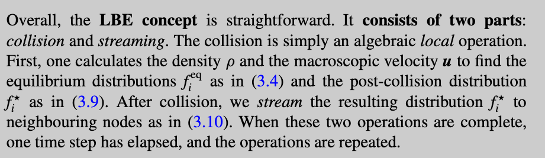​

### Implementation of LBM

[The Lattice Boltzmann Method Principles and Practice.pdf - p87 - Full LBM](LBM Principles and practice/The Lattice Boltzmann Method Principles and Practice-20231014203512-ry3qjqr.pdf?p=87)  
​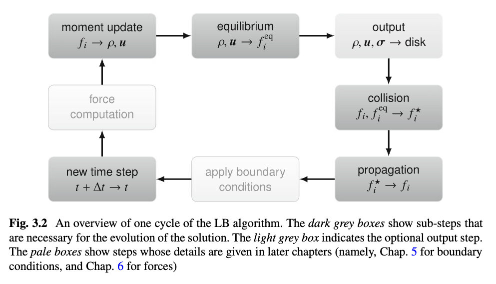​

初始化：假设流体从平衡态开始，当然也有别的初始化方法

* 初始条件给出的是$t=0$时刻的流体密度和速度场，通过之前的$f_i^{eq}$公式给出。

$$
f_i^{eq}(x, t=0) = f_i^{eq}(\rho(x, 0), u(x, 0))
$$

> [The Lattice Boltzmann Method Principles and Practice.pdf - p87 - 初始化](LBM Principles and practice/The Lattice Boltzmann Method Principles and Practice-20231014203512-ry3qjqr.pdf?p=87)  
> ​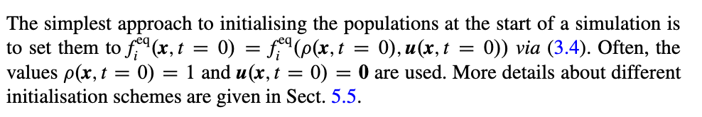​

时间步：

> [The Lattice Boltzmann Method Principles and Practice.pdf - p87 - Time step](LBM Principles and practice/The Lattice Boltzmann Method Principles and Practice-20231014203512-ry3qjqr.pdf?p=87)  
> ​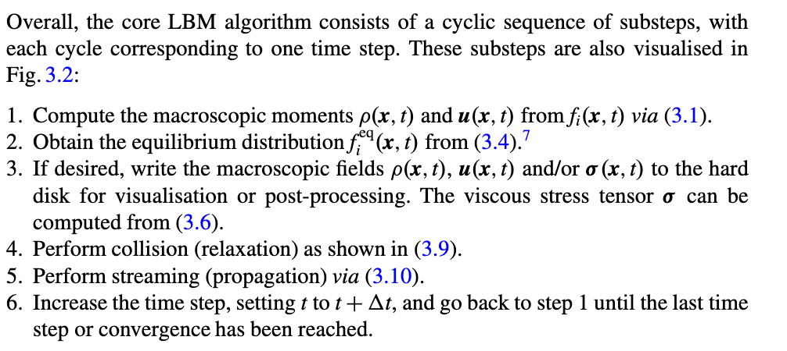​

很简单吧。为了方便还是将平衡方程放在这里：

[The Lattice Boltzmann Method Principles and Practice.pdf - p84 - 平衡态分布函数](LBM Principles and practice/The Lattice Boltzmann Method Principles and Practice-20231014203512-ry3qjqr.pdf?p=84)  
​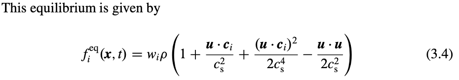​

### Memory layout and coding hint

## 速度空间离散化

之前我们没有对于速度空间进行离散化。

当然也可以直接对速度空间用稠密的网格进行离散，但是效率很低。我们可以直接将其限制在一个很稀疏的网格上：

$$
f(v; x, t) = f(v_{i, j} ; x, t)
$$

这里的$v_{i, j}$经过离散化后只有$n$个，所以一般直接写成 $v_i$ 的形式，避免两重指标。

[The Lattice Boltzmann Method Principles and Practice.pdf - p91 - 经过相当粗暴的离散后，这样的方程依然足够求解NSE](LBM Principles and practice/The Lattice Boltzmann Method Principles and Practice-20231014203512-ry3qjqr.pdf?p=91)  
​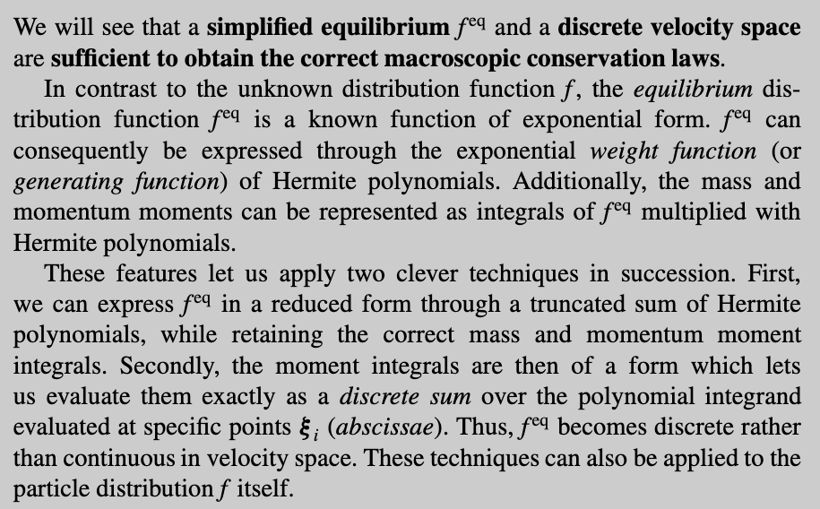​

### non-dimensionalization（无量纲化？）

[The Lattice Boltzmann Method Principles and Practice.pdf - p92 - 无量纲化过程](LBM Principles and practice/The Lattice Boltzmann Method Principles and Practice-20231014203512-ry3qjqr.pdf?p=92)  
​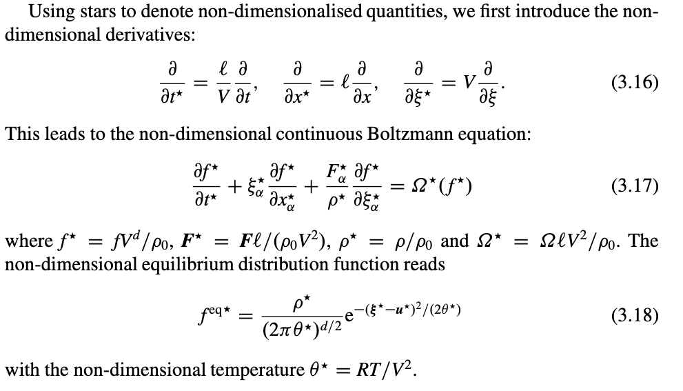​

[The Lattice Boltzmann Method Principles and Practice.pdf - p93 - 维度无关形式](LBM Principles and practice/The Lattice Boltzmann Method Principles and Practice-20231014203512-ry3qjqr.pdf?p=93)  
​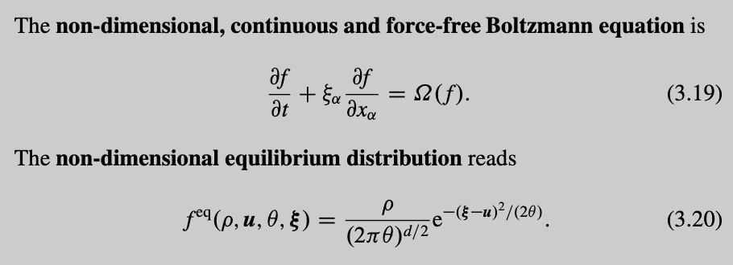​

### Conservation laws

我们需要找出在进行速度离散后，积分所对应的离散形式。

[The Lattice Boltzmann Method Principles and Practice.pdf - p93 - 守恒定律](LBM Principles and practice/The Lattice Boltzmann Method Principles and Practice-20231014203512-ry3qjqr.pdf?p=93)  
​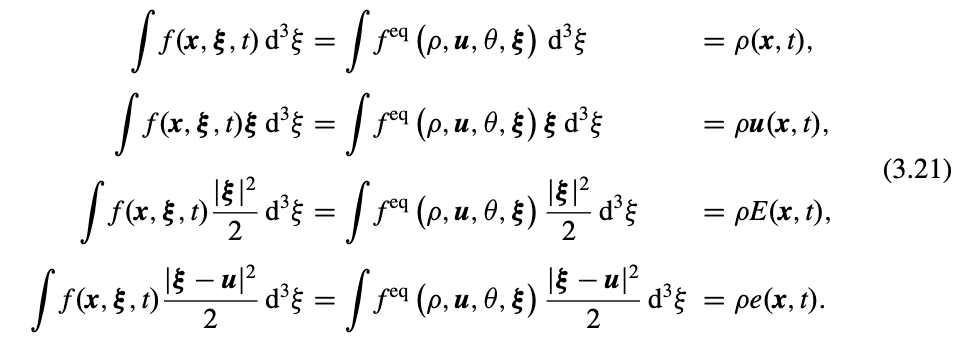​

### Hermite Polynomials

对于积分离散近似很常用。

[The Lattice Boltzmann Method Principles and Practice.pdf - p97 - Hermite展开和积分](LBM Principles and practice/The Lattice Boltzmann Method Principles and Practice-20231014203512-ry3qjqr.pdf?p=97)  
​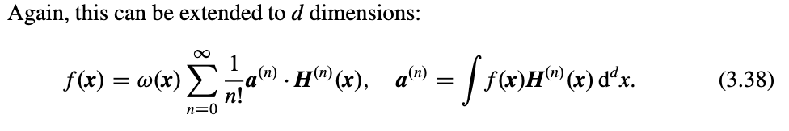​

### Hermite Series Expansion of the eq distribution

[The Lattice Boltzmann Method Principles and Practice.pdf - p98 - Hermite多项式展开形式](LBM Principles and practice/The Lattice Boltzmann Method Principles and Practice-20231014203512-ry3qjqr.pdf?p=98)  
​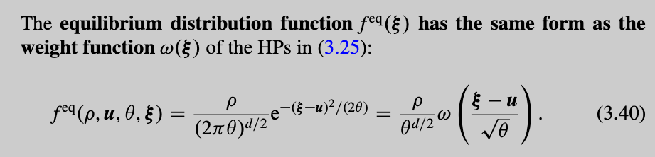​

[The Lattice Boltzmann Method Principles and Practice.pdf - p98 - 这边说明了，展开的前三项就能够计算出完整的质量动量能量](LBM Principles and practice/The Lattice Boltzmann Method Principles and Practice-20231014203512-ry3qjqr.pdf?p=98)  
​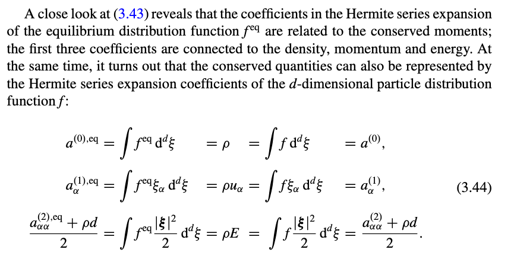

因为这样的性质，我们可以值计算前三项

> [The Lattice Boltzmann Method Principles and Practice.pdf - p99 - 足以能够恢复宏观空气动力学守恒方程。](LBM Principles and practice/The Lattice Boltzmann Method Principles and Practice-20231014203512-ry3qjqr.pdf?p=99)  
> ​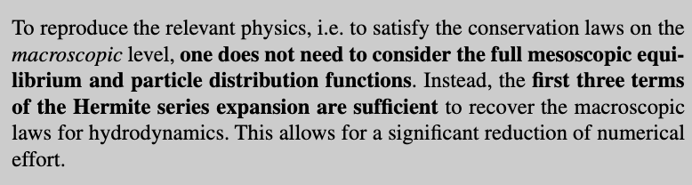​

[The Lattice Boltzmann Method Principles and Practice.pdf - p99 - 因此近似时，可以只需要保留前三项](LBM Principles and practice/The Lattice Boltzmann Method Principles and Practice-20231014203512-ry3qjqr.pdf?p=99)  
​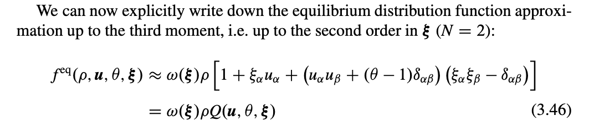​

### Discretization of the eq dist function

[The Lattice Boltzmann Method Principles and Practice.pdf - p101 - 对于连续方程，选取有限个速度分量并不影响守恒律。](LBM Principles and practice/The Lattice Boltzmann Method Principles and Practice-20231014203512-ry3qjqr.pdf?p=101)  
​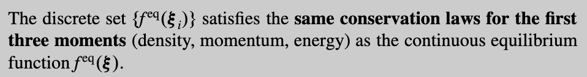​

[The Lattice Boltzmann Method Principles and Practice.pdf - p102 - 最终的分布函数离散](LBM Principles and practice/The Lattice Boltzmann Method Principles and Practice-20231014203512-ry3qjqr.pdf?p=102)  
​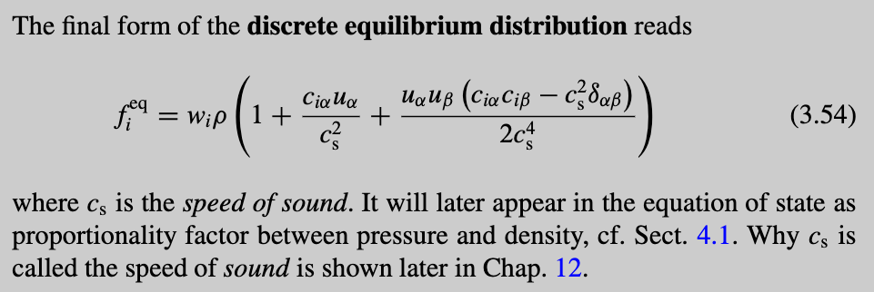​

### Discretization of the particle distribution function

[The Lattice Boltzmann Method Principles and Practice.pdf - p103 - 对于求解变量用Hermite展开，取三项，然后离散化](LBM Principles and practice/The Lattice Boltzmann Method Principles and Practice-20231014203512-ry3qjqr.pdf?p=103)  
​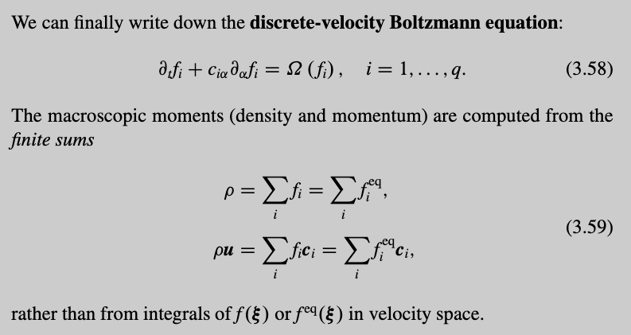​

## 速度集合

### Construction and requirements.

[The Lattice Boltzmann Method Principles and Practice.pdf - p105 - 从旋转无关等角度考虑](LBM Principles and practice/The Lattice Boltzmann Method Principles and Practice-20231014203512-ry3qjqr.pdf?p=105)  
​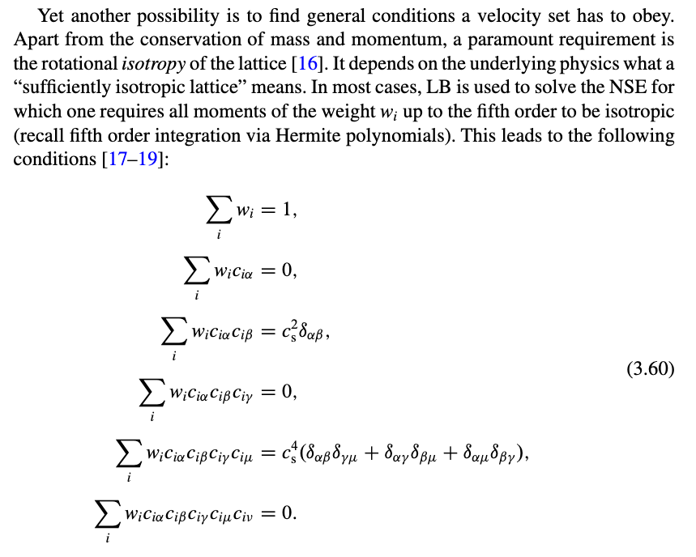​

一些常用的速度集

[The Lattice Boltzmann Method Principles and Practice.pdf - p106 - D1Q3,D2Q9](LBM Principles and practice/The Lattice Boltzmann Method Principles and Practice-20231014203512-ry3qjqr.pdf?p=106)  
​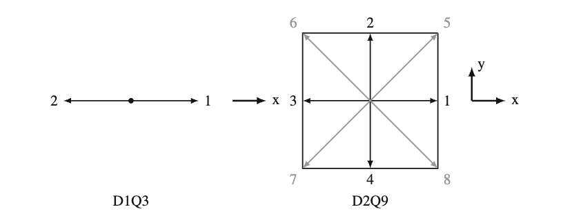​

[The Lattice Boltzmann Method Principles and Practice.pdf - p107 - D3Q15 19 27](LBM Principles and practice/The Lattice Boltzmann Method Principles and Practice-20231014203512-ry3qjqr.pdf?p=107)  
​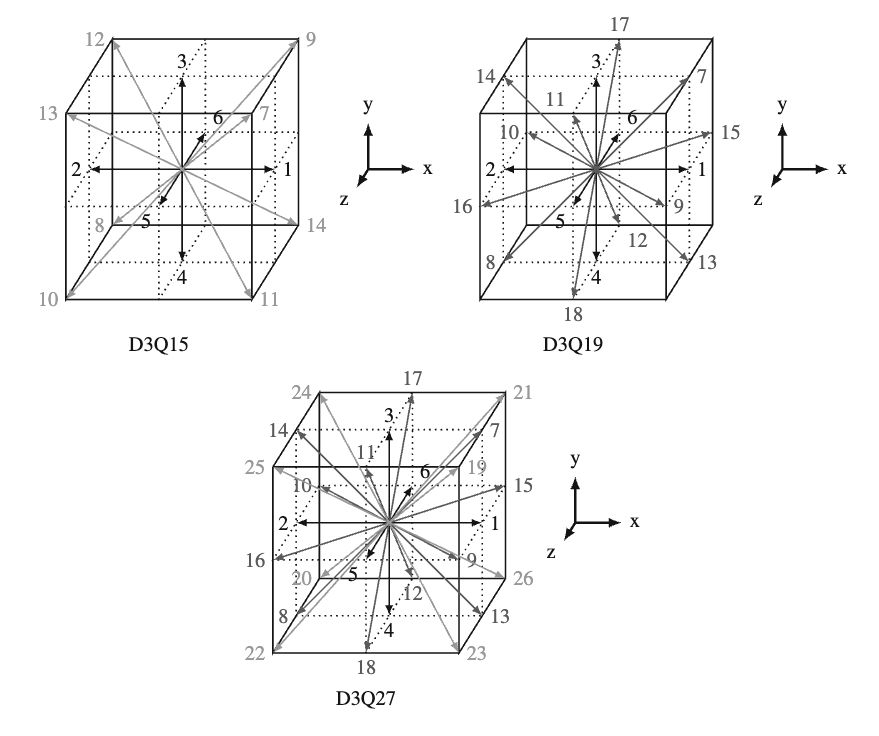​

Table for implementation

[The Lattice Boltzmann Method Principles and Practice.pdf - p108 - The Lattice Boltzmann Method Principles and Practice-P108-20231015150757](LBM Principles and practice/The Lattice Boltzmann Method Principles and Practice-20231014203512-ry3qjqr.pdf?p=108)  
​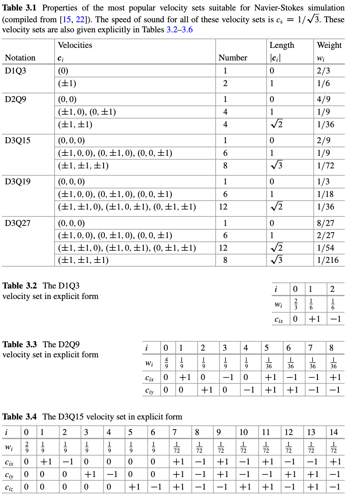​

[The Lattice Boltzmann Method Principles and Practice.pdf - p109 - d3q19](LBM Principles and practice/The Lattice Boltzmann Method Principles and Practice-20231014203512-ry3qjqr.pdf?p=109)  
​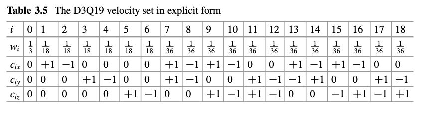​

## 时间和空间离散化

终于是正常一点的东西。

一般就是等距网格，以及可以选择如下的Refinement。

> [The Lattice Boltzmann Method Principles and Practice.pdf - p114 - local grid refinement of the LBM on structured grids is possible ([31] gives an overview of this), the most common form of space discretisation is a uniform and structured grid.](LBM Principles and practice/The Lattice Boltzmann Method Principles and Practice-20231014203512-ry3qjqr.pdf?p=114)

原始的LB算法假设其每个格点都迁移到其邻居（或自身）。

> [The Lattice Boltzmann Method Principles and Practice.pdf - p114 - Overall, the original LB algorithm assumes that populations fi move with velocity ci from one lattice site to another. After one time step ĩt, each population should exactly reach a neighbouring site.](LBM Principles and practice/The Lattice Boltzmann Method Principles and Practice-20231014203512-ry3qjqr.pdf?p=114)

这对于原始问题有一定的要求。

1. 空间网格是等距规则的
2. 速度分量是$dx/dt$的倍数

### 特征线方程

[The Lattice Boltzmann Method Principles and Practice.pdf - p114 - 类似于传输线方程，但含一个系数](LBM Principles and practice/The Lattice Boltzmann Method Principles and Practice-20231014203512-ry3qjqr.pdf?p=114)  
​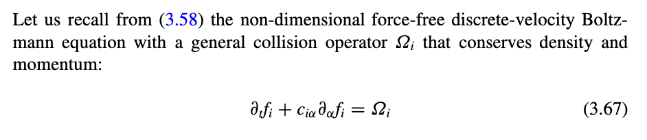​

[The Lattice Boltzmann Method Principles and Practice.pdf - p116 - The Lattice Boltzmann Method Principles and Practice-P116-20231015163732](LBM Principles and practice/The Lattice Boltzmann Method Principles and Practice-20231014203512-ry3qjqr.pdf?p=116)  
​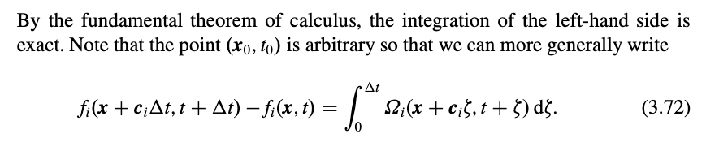​

### First and second order discretisation

[The Lattice Boltzmann Method Principles and Practice.pdf - p117 - LBE](LBM Principles and practice/The Lattice Boltzmann Method Principles and Practice-20231014203512-ry3qjqr.pdf?p=117)  
​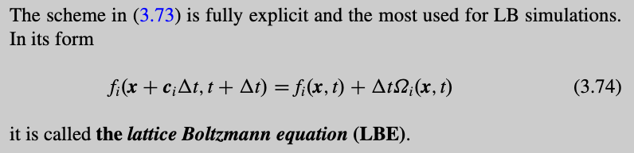​

[The Lattice Boltzmann Method Principles and Practice.pdf - p118 - Second Order method](LBM Principles and practice/The Lattice Boltzmann Method Principles and Practice-20231014203512-ry3qjqr.pdf?p=118)  
​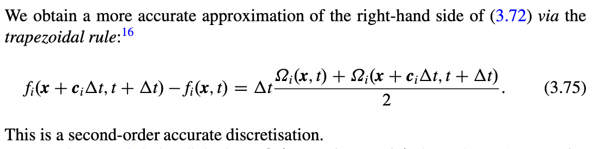​

### BGK Operator

[The Lattice Boltzmann Method Principles and Practice.pdf - p119 - This collision operator is only suitable for gas simulations, as it only accounts for binary collisions between molecules.](LBM Principles and practice/The Lattice Boltzmann Method Principles and Practice-20231014203512-ry3qjqr.pdf?p=119)

[The Lattice Boltzmann Method Principles and Practice.pdf - p119 - 碰撞算子的一大性质是保持质量和动量守恒](LBM Principles and practice/The Lattice Boltzmann Method Principles and Practice-20231014203512-ry3qjqr.pdf?p=119)  
​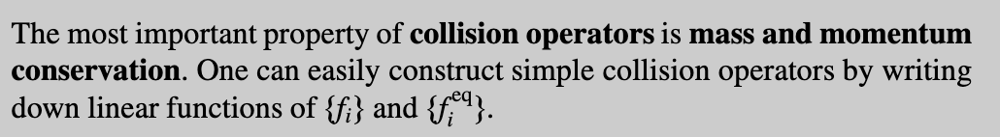​

[The Lattice Boltzmann Method Principles and Practice.pdf - p120 - LBGK方程，将BGK算子离散化后代入](LBM Principles and practice/The Lattice Boltzmann Method Principles and Practice-20231014203512-ry3qjqr.pdf?p=120)  
​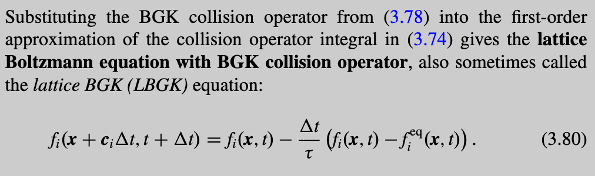​

#### Over Relaxation

[The Lattice Boltzmann Method Principles and Practice.pdf - p120 - 如果选取的参数错误，将导致问题](LBM Principles and practice/The Lattice Boltzmann Method Principles and Practice-20231014203512-ry3qjqr.pdf?p=120)，$\tau$决定了 $\Delta t$的取值。  
​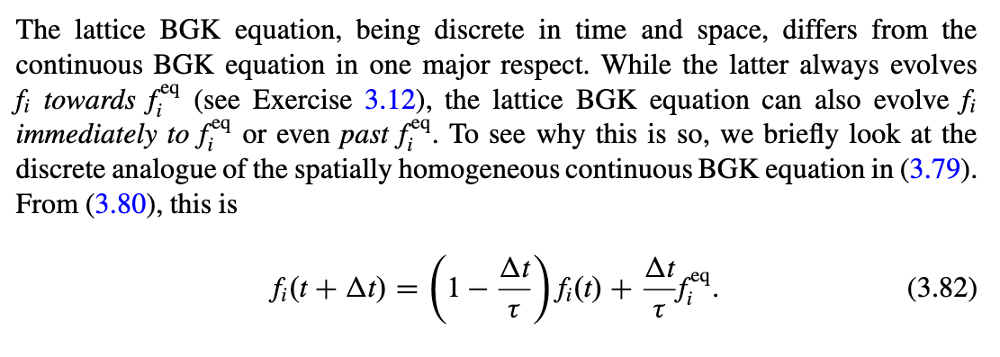​

[The Lattice Boltzmann Method Principles and Practice.pdf - p121 - 这里直接给出了Stability 的必要条件。](LBM Principles and practice/The Lattice Boltzmann Method Principles and Practice-20231014203512-ry3qjqr.pdf?p=121)  
​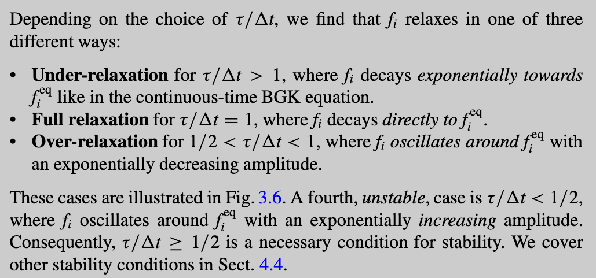​

## Streaming and collision

[The Lattice Boltzmann Method Principles and Practice.pdf - p122 - LBGK算法，类似Operator Splitting](LBM Principles and practice/The Lattice Boltzmann Method Principles and Practice-20231014203512-ry3qjqr.pdf?p=122)  
​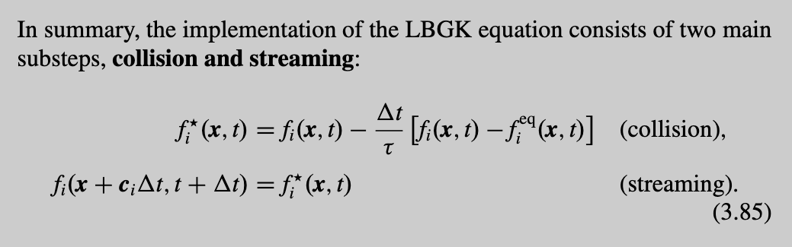​

[The Lattice Boltzmann Method Principles and Practice.pdf - p122 - Now we have derived everything required to write a first LB simulation code, except boundary conditions and forces.](LBM Principles and practice/The Lattice Boltzmann Method Principles and Practice-20231014203512-ry3qjqr.pdf?p=122)

# Stability

## Analysis

[The Lattice Boltzmann Method Principles and Practice.pdf - p148 - The Lattice Boltzmann Method Principles and Practice-P148-20231015170322](LBM Principles and practice/The Lattice Boltzmann Method Principles and Practice-20231014203512-ry3qjqr.pdf?p=148)  
​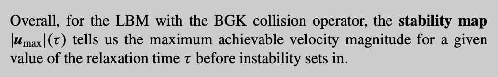​

## BGK model

[The Lattice Boltzmann Method Principles and Practice.pdf - p150 - BGK model：一定条件下，所有的eq非负，但eq是由速度决定的，可以通过速度来推导](LBM Principles and practice/The Lattice Boltzmann Method Principles and Practice-20231014203512-ry3qjqr.pdf?p=150)  
​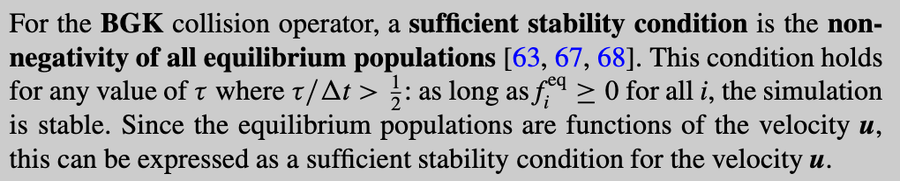​

[The Lattice Boltzmann Method Principles and Practice.pdf - p151 - 在参数满足的条件下，对流速有如下的要求可以保证稳定性](LBM Principles and practice/The Lattice Boltzmann Method Principles and Practice-20231014203512-ry3qjqr.pdf?p=151)  
​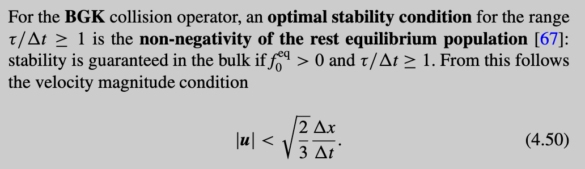​

[The Lattice Boltzmann Method Principles and Practice.pdf - p153 - 可以看出，粘性对于LBM的稳定有很大的意义](LBM Principles and practice/The Lattice Boltzmann Method Principles and Practice-20231014203512-ry3qjqr.pdf?p=153)  
​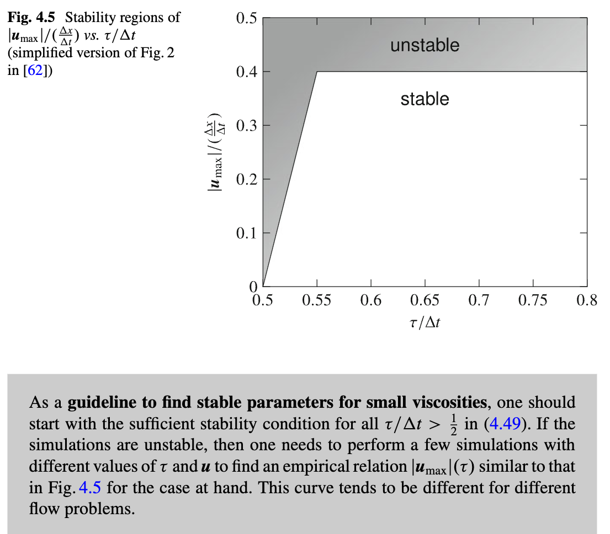​

# Boundaries

## Periodic

[The Lattice Boltzmann Method Principles and Practice.pdf - p191 - The Lattice Boltzmann Method Principles and Practice-P191-20231015170953](LBM Principles and practice/The Lattice Boltzmann Method Principles and Practice-20231014203512-ry3qjqr.pdf?p=191)  
​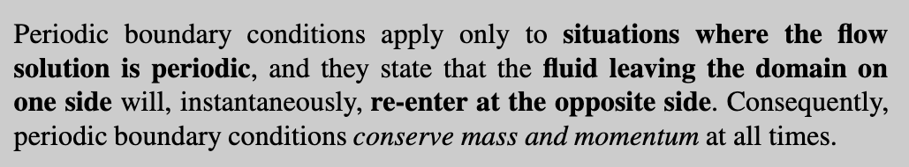​

[The Lattice Boltzmann Method Principles and Practice.pdf - p192 - 虚拟节点，直接按周期传递。](LBM Principles and practice/The Lattice Boltzmann Method Principles and Practice-20231014203512-ry3qjqr.pdf?p=192)  
​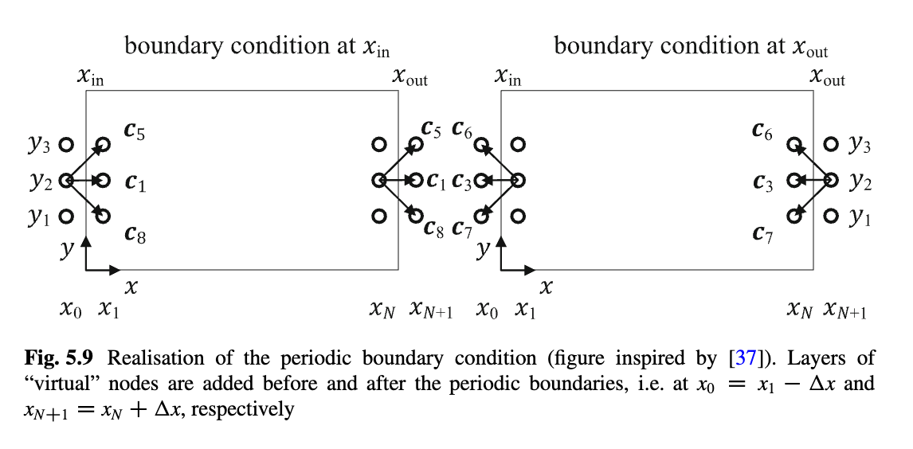​

## Solid boundaries：Bounce back approach

[The Lattice Boltzmann Method Principles and Practice.pdf - p195 - Despite its age, it is still the most popular wall boundary scheme in the LB community, largely due to its simplicity of implementation.](LBM Principles and practice/The Lattice Boltzmann Method Principles and Practice-20231014203512-ry3qjqr.pdf?p=195)

### Principle

[The Lattice Boltzmann Method Principles and Practice.pdf - p196 - 图示](LBM Principles and practice/The Lattice Boltzmann Method Principles and Practice-20231014203512-ry3qjqr.pdf?p=196)  
​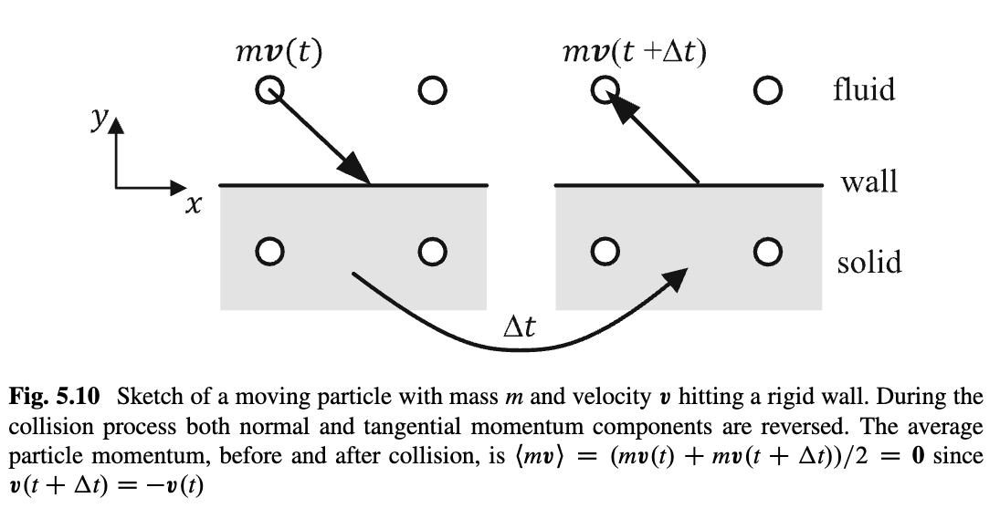​

[The Lattice Boltzmann Method Principles and Practice.pdf - p196 - 原理是，碰到墙反弹到它原来的地方。](LBM Principles and practice/The Lattice Boltzmann Method Principles and Practice-20231014203512-ry3qjqr.pdf?p=196)  
​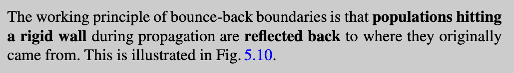​

满足no-slip条件！

### Fullway v.s. Halfway bounce-back method.

两种实现方式：

1. Fullway：下一个时间步反弹回来
2. Halfway：当前时间步骤直接反弹

[The Lattice Boltzmann Method Principles and Practice.pdf - p197 - The Lattice Boltzmann Method Principles and Practice-P197-20231015191535](LBM Principles and practice/The Lattice Boltzmann Method Principles and Practice-20231014203512-ry3qjqr.pdf?p=197)  
​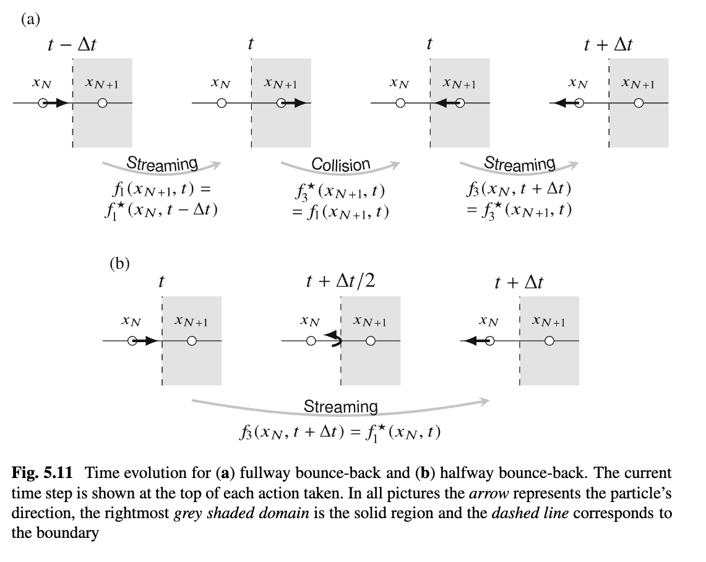​

[The Lattice Boltzmann Method Principles and Practice.pdf - p198 - 无论是哪种，都假设了碰撞发生在Midway。](LBM Principles and practice/The Lattice Boltzmann Method Principles and Practice-20231014203512-ry3qjqr.pdf?p=198)  
​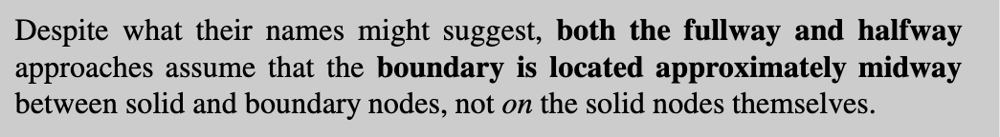​

* 实现上：fullway简单
* 准确性上：Halfway

> [The Lattice Boltzmann Method Principles and Practice.pdf - p198 - The question that arises is: which strategy to implement? Fullway or halfway? There is no definitive answer. If simplicity is our main criterion, then fullway bounce-back wins. Here, the boundary treatment is independent of the direction of fi and the execution time is shorter, cf. Chap. 13. 13 Yet, halfway bounce-back is more accurate for unsteady flows as explained below.](LBM Principles and practice/The Lattice Boltzmann Method Principles and Practice-20231014203512-ry3qjqr.pdf?p=198)

### Resting walls

[The Lattice Boltzmann Method Principles and Practice.pdf - p199 - 固定边界](LBM Principles and practice/The Lattice Boltzmann Method Principles and Practice-20231014203512-ry3qjqr.pdf?p=199)  
​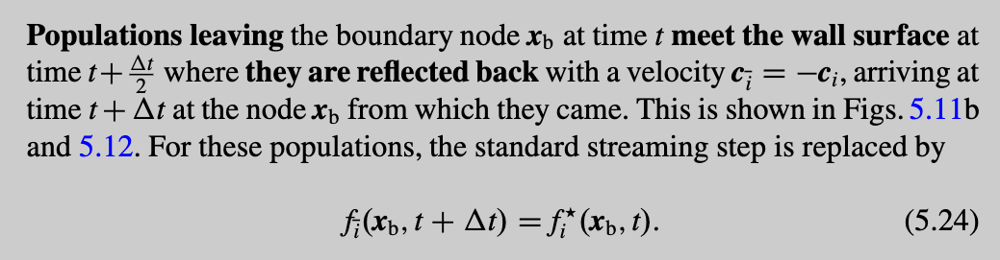​

### Moving walls

[The Lattice Boltzmann Method Principles and Practice.pdf - p200 - 移动边界](LBM Principles and practice/The Lattice Boltzmann Method Principles and Practice-20231014203512-ry3qjqr.pdf?p=200)  
​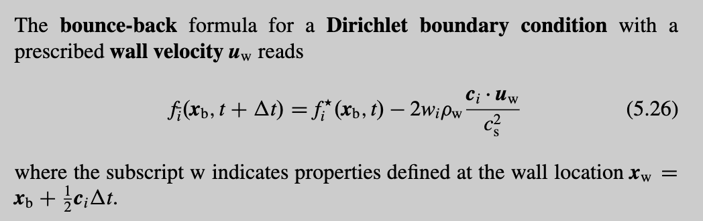​

第二项的作用是使其能够满足质量守恒。

[The Lattice Boltzmann Method Principles and Practice.pdf - p209 - The Lattice Boltzmann Method Principles and Practice-P209-20231015192559](LBM Principles and practice/The Lattice Boltzmann Method Principles and Practice-20231014203512-ry3qjqr.pdf?p=209)  
​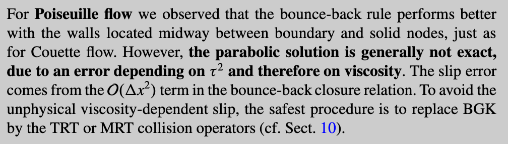​

## Solid bc: Wet-node approach

idea：在边界上赋予合适的值，期望LBM能有合理的输出。

> [The Lattice Boltzmann Method Principles and Practice.pdf - p209 - The idea of the wet-node approach is to assign suitable values for the unknown boundary populations such that the known and constructed populations reproduce the intended hydrodynamics at the boundary.](LBM Principles and practice/The Lattice Boltzmann Method Principles and Practice-20231014203512-ry3qjqr.pdf?p=209)

通常而言，会有导致欠定

> [The Lattice Boltzmann Method Principles and Practice.pdf - p209 - there are typically more unknown boundary populations than macroscopic conditions](LBM Principles and practice/The Lattice Boltzmann Method Principles and Practice-20231014203512-ry3qjqr.pdf?p=209)

变成法向相对速度为零

> [The Lattice Boltzmann Method Principles and Practice.pdf - p210 - The continuity of the fluid at the boundary is described by the well-known impermeable wall condition, i.e. zero relative normal velocity of the fluid](LBM Principles and practice/The Lattice Boltzmann Method Principles and Practice-20231014203512-ry3qjqr.pdf?p=210)

### Eq state

用$f_i^{eq}$来设置边界处的BC

[The Lattice Boltzmann Method Principles and Practice.pdf - p211 - The Lattice Boltzmann Method Principles and Practice-P211-20231015193430](LBM Principles and practice/The Lattice Boltzmann Method Principles and Practice-20231014203512-ry3qjqr.pdf?p=211)  
​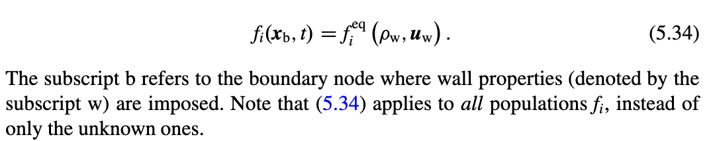​

好用，但问题也很大。

### Non-eq Extrapolation

[The Lattice Boltzmann Method Principles and Practice.pdf - p214 - The Lattice Boltzmann Method Principles and Practice-P214-20231015193824](LBM Principles and practice/The Lattice Boltzmann Method Principles and Practice-20231014203512-ry3qjqr.pdf?p=214)  
​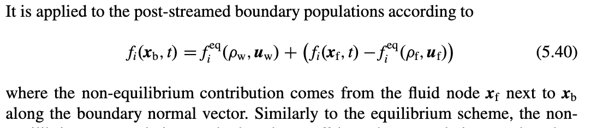​

用一部分流体项修正。

### NEBB

[The Lattice Boltzmann Method Principles and Practice.pdf - p216 - The Lattice Boltzmann Method Principles and Practice-P216-20231015193904](LBM Principles and practice/The Lattice Boltzmann Method Principles and Practice-20231014203512-ry3qjqr.pdf?p=216)  
​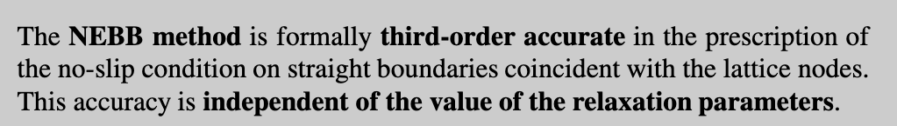​

很麻烦，很精确。

### Open bc

[The Lattice Boltzmann Method Principles and Practice.pdf - p219 - The Lattice Boltzmann Method Principles and Practice-P219-20231015194010](LBM Principles and practice/The Lattice Boltzmann Method Principles and Practice-20231014203512-ry3qjqr.pdf?p=219)  
​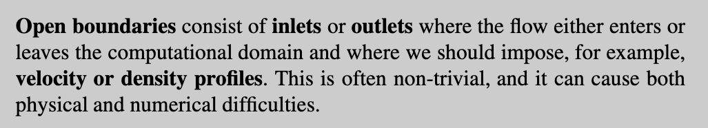​

‍
