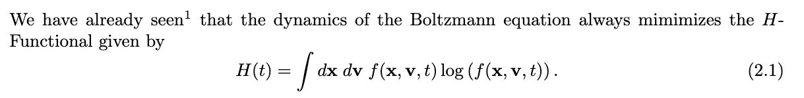
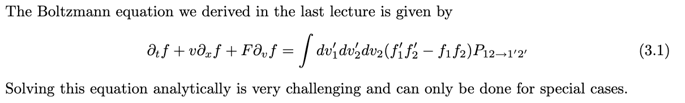
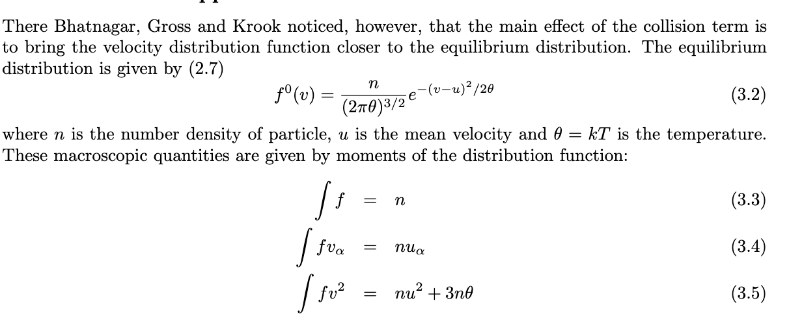
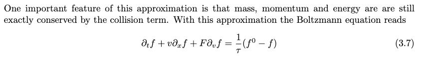
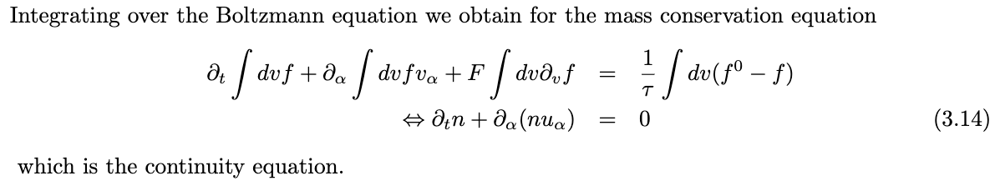
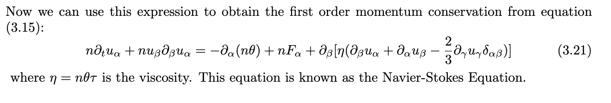
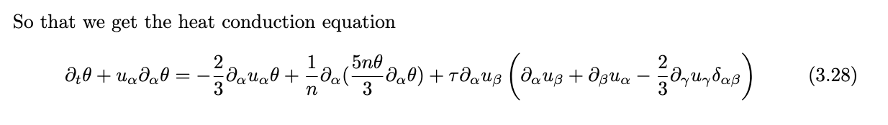
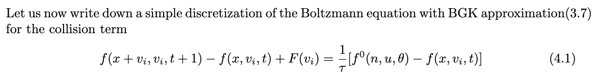
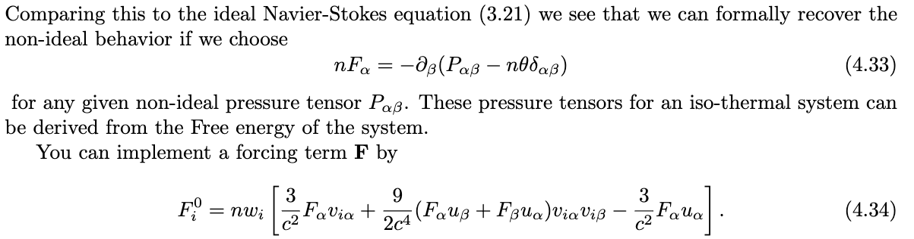

[LBbook.  pdf](Lattice boltzmann method/LBbook-20231014200646-n14he95.pdf)

[The Lattice Boltzmann Method Principles and Practice.pdf](Lattice boltzmann method/The Lattice Boltzmann Method Principles and Practice-20231014203512-ry3qjqr.pdf)

LBM: Principles and practice

# Introduction

优点：可以模拟相当Noisy的空气动力学。[LBbook.pdf - p7 - it was shown that the lattice gas methods could be used to simulate(rather noisy) hydrodynamics.](Lattice boltzmann method/LBbook-20231014200646-n14he95.pdf?p=7)

Applications：[LBbook.pdf - p7 -  turbulence, multi-component and multi-phase flows as well als additional applications, including simulations of the Schr ̈odinger equation.](Lattice boltzmann method/LBbook-20231014200646-n14he95.pdf?p=7)

## Boltzmann Eqn

[LBbook.pdf - p9 - LBbook-P9-20231014202728](Lattice boltzmann method/LBbook-20231014200646-n14he95.pdf?p=9)  
​​

## Derivation of the hydrodynamic eqn from boltzmann eqn

[LBbook.pdf - p11 - e macroscopic equations of motion are simply the conservation equations for continuous field](Lattice boltzmann method/LBbook-20231014200646-n14he95.pdf?p=11)

### The boltzmann eqn

[LBbook.pdf - p11 - LBbook-P11-20231014203009](Lattice boltzmann method/LBbook-20231014200646-n14he95.pdf?p=11)  
​​

#### BGK approximation

[LBbook.pdf - p11 - BGK模型给出的稳态分布方程](Lattice boltzmann method/LBbook-20231014200646-n14he95.pdf?p=11)  
​​

[LBbook.pdf - p12 - LBbook-P12-20231022093150](Lattice boltzmann method/LBbook-20231014200646-n14he95.pdf?p=12)  
​​

### Mass conservation

由Boltzmann 方程自然给出：

[LBbook.pdf - p12 - LBbook-P12-20231014203531](Lattice boltzmann method/LBbook-20231014200646-n14he95.pdf?p=12)  
​​

### Momentum conservation

[LBbook.pdf - p13 - LBbook-P13-20231014203715](Lattice boltzmann method/LBbook-20231014200646-n14he95.pdf?p=13)  
​​

可以直接得到NSE

### Energy conservation

[LBbook.pdf - p14 - LBbook-P14-20231014203757](Lattice boltzmann method/LBbook-20231014200646-n14he95.pdf?p=14)  
​​

热传导方程

## LB

### Lattice boltzmann eqn.

[LBbook.pdf - p17 - LBbook-P17-20231014203832](Lattice boltzmann method/LBbook-20231014200646-n14he95.pdf?p=17)  
​​

即使是BGK模型简化，也能够求解流体。[LBbook.pdf - p17 -  the hydrodynamic limit of this this discretized version of the Boltzmann are still the well known equations for fluid flow](Lattice boltzmann method/LBbook-20231014200646-n14he95.pdf?p=17)

### Non-ideal fluids

理想流体可以求解。非理想的也可以：

[LBbook.pdf - p21 - LBbook-P21-20231014205103](Lattice boltzmann method/LBbook-20231014200646-n14he95.pdf?p=21)  
​​
