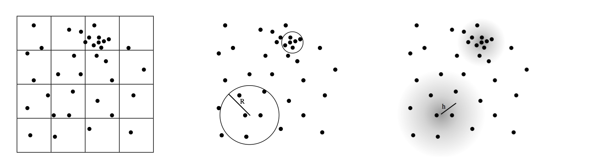

!!! warn "This page is not reviewed"

<!-- more -->

# SPH 光滑粒子

## 基础

### SPH -- Smoothed Particle Hydrodynamics

> 基本方程来自于：
>
> 1. [Smoothed Particle Hydrodynamics and Magnetohydrodynamics. Journal of Computational Physics](https://arxiv.org/abs/1012.1885)
> 2. [Smoothed Particle Hydrodynamics - Report on Progress in Physics](https://www.researchgate.net/publication/230988821_Smoothed_Particle_Hydrodynamics)

​​

思想：对于任一物理量，通过流体在一系列**采样点**处的值，来插值近似得到流体在任意位置的值。

$$
A _ i = \sum _ {j \in \mathcal N _ i} \frac{m _ j} { \rho _ j } A _ j W _ {ij}
$$

其中的$W_{ij}$是权重函数。

从而定义如下的空间离散微分运算

$$
\begin{aligned}
\nabla A_i = \rho_i + \sum_{j} m_j  \left ( \frac { A _ i} { \rho _ i  ^ 2} + \frac{A _ j} {\rho _ j ^ 2}\right) \nabla W_ { i j }\\
\nabla \cdot \mathbf{A}_i = - \frac 1 { \rho _ i} \sum _ j m _ j \mathbf A _ {ij} \cdot \nabla W _ {ij} \\
\nabla ^ 2 A _ i = 2 \sum _ { j } \frac { m _ j} { \rho _ j} A _ {ij} \frac {\mathbf x _ {ij} \cdot \nabla W _ { ij }}{\mathbf x _ {ij} \cdot \mathbf x _ {ij} + 0.01 h ^ 2}
\end{aligned}
$$

最后一个公式是拉普拉斯算子，$0.01h^2$是正则化项。

密度能够用如下公式计算

$$
\rho_i  = \sum_j m_j W_{ij}
$$

### 算法框架

SPH 求解器有如下三大组件：

1. 邻域搜索
2. 压强计算
3. 时间积分

其中时间积分通常和压强计算一起讨论，主要研究内容是如何计算压强以满足流体的不可压缩性。

```
foreach Particle P: -> 1
  find neighbours.
foreach Particle P: 
  compute density.
foreach Particle P: -> 2
  compute pressure force.
  compute viscosity force
  compute external force
  merge all the forces.

foreach Particle P: -> 3
  update velocity, position.
```

时间积分步长：

> **CFL Condition** should be considered carefully when using this method.

$$
\Delta t \le \lambda \frac{ h } { \| v _ {\max} \| }, \qquad \mathrm{with}~~\lambda \approx 0.4
$$

## 邻域搜索

主要有两类算法

1. 层次数据结构
2. 均匀网格划分

### 层次数据结构

主要有如下几种数据结构：

1. Kd树（八叉树）和多分辨率网格方法
2. VDB数据结构

### 均匀网格划分

将整个空间均匀地划分为网格，构建时将粒子分配到各个网格中，查询邻居时查询相邻多个网格中的粒子。

#### Index Sort

在构建时尽可能避免Race Condition，利用并行提高性能。

1. [Particle-based fluid simulation.](http://developer.download.nvidia.com/presentations/2008/GDC/GDC08_ ParticleFluids.pdf)

#### Z-index Sort

提升程序的空间连续性，增加缓存命中概率。

1. [Interactive SPH simulation and rendering on the GPU](https://dl.acm.org/doi/10.5555/1921427.1921437)

#### Hash

使用空间散列方法。

1. [A parallel SPH implementation on multi-core CPUs.](https://www.researchgate.net/publication/220506746_A_parallel_SPH_implementation_on_multi-core_CPUs)

#### GPU 方法

SPH方法几乎没有数据依赖问题，因此可以利用GPU来进行加速。

1. Real-time smoke rendering using compensated ray marching.
2. Temporal blending for adaptive SPH.

### 总结

时间复杂度：Hierarchy > Grid

1. Grids: $O(n)$ build, $O(1)$ access
2. Hierarchy: $O(n log n)$ build, $O(log n)$ access.

空间复杂度：Hierarchy < Grid.

1. Iterative: Reuse the structure frequently, and we can store the neighborhood set, and rebuild it from time to time.
2. Non-Iterative:

## 不可压缩性

流体的不可压缩性体现在压强上。

大体上有两类解法：

1. 弱可压缩：弱可压缩流体并没有严格求解不可压缩方程$\nabla u = 0$，但通过压强来施加一个恢复原本体积的力，来“模拟”不可压缩性。

    对应：<u>Local</u> Pressure Solver
2. 强可压缩：相反的，其求解了不可压缩方程，使得不可压缩性严格满足

    对应：<u>Global</u> Pressure Solver

### 弱可压缩流体（Non-Iterative EOS Solvers）

弱可压缩性直接通过单次、显式的压强计算来体现：

例如直接用EOS（状态方程）求解

$$
p = p (\rho , T) = \frac{\mu}{R} \rho T
$$

通常使用的是：

$$
p_i = k \left( \left ( \frac{\rho_i}{\rho_0}\right) ^ 7 - 1 \right)
$$

也有多种不同的选择：

1. A switch to reduce SPH viscosity.
2. $p_i = k (\rho_i - \rho_0)$：Smoothed particles: A new paradigm for animating highly deformable bodies.
3. $p_i= k(\frac{\rho_i}{\rho_0}- 1)$：Adaptively sampled particle fluids

也通过 Operator Splitting 来将压强计算和其他力的计算分开：

```
foreach P: find neighbours
foreach P: compute Non-Pressure forces  -> Advection
foreach P: compute Pressure forces.     -> Projection, use data from Advection
foreach P: update velocity & position
```

### 强可压缩流体

强可压缩流体可以通过：

1. 多次迭代应用弱可压缩流体的方程（Operator Splitting的第三步多次迭代）
2. 直接求解EOS方程

第一类的实现：

1. PCISPH
2. LPSPH

```
foreach P: find neighbours
foreach P: compute Non-Pressure part.       -> Advection
repeat until convergence:                   -> Projection(weak)
  foreach P: compute density and pressure
  foreach P: update velocity and positions
```

第二类的实现：

1. IISPH

```
foreach P: find neighbours
foreach P: compute Non-Pressure part.       -> Advection
foreach P: compute rho*
solve PPE                                   -> Projection
compute Pressure Force
update v, x
```

## 边界处理和流固耦合

主要有如下几类方法：

1. 基于粒子
2. 基于隐式曲面
3. 基于边界压强
4. 基于惩罚

### 粒子方法

对于其他物体表面也离散为粒子，计算基于粒子距离的惩罚力

> The boundary particles serve as additional sampling points and typically have the same radius as the fluid particles.

$$
\rho_i = \rho_{\mathcal{F}} + \rho_{\mathcal{B}} \approx \sum_j m_j W_{ij} + \sum_k \tilde{m}_k W_{ik}
$$

计算压强和力时，需要考虑从其他物体表面采样的其他粒子。

根据采样方法的不同，可以分为：

1. 均匀采样、非均匀采样：对于曲率较大处的边界应该被分配更多的采样点来保持细节
2. 单层、多层采样：多层采样有助于防止穿透

优点：

1. 算法实现简单：生成采样点、积分、计算实现简单

缺点：

1. 对于弱可压缩流体，需要小时间步长（压强变化大）
2. 简单的几何图形都需要大规模的粒子
3. 边界处理并不准确

    > *bumpy representation*: reduce the accuracy of pressure computation, introduce artificial friction. → Implicit boundary representation.
    >

### 隐式曲面表示

‍

### 边界压强计算

不依赖于粒子，而直接对于边界生成压强：

Original, without boundary:

$$
(a_i^P)^l = - \frac{1}{\rho_i} \nabla p_i^l = - \sum_j m \left( p_i^l/\rho_i^2 + p_j^l/\rho_j^2 \right)\Delta W_{ij}
$$

With boundary:

$$
(a_i^P)^l = - \sum_j m_j \left( p_i^l/\rho_i^2 + p_j^l/\rho_j^2 \right)\Delta W_{ij} - \sum_k m_k \left( p_i^l/\rho_i^2 + p_k^l/\rho_k^2 \right)\Delta W_{ik}
$$

对于其中的$p_k$，有几种定义方式：

1. Pressure Mirroring: $p_k = p_i$
2. Pressure Extrapolation:

$$
p_k = \frac{\sum_l p_lW_{kl}+ \mathbf{g} \cdot \sum_j \rho_l(x_k - x_l)W_{kl}}{\sum_l W_{kl}}
$$

‍

### 基于惩罚

**缺点**: hard to control the stiffness, and have small time steps.

## 总结

SPH 方法的问题：

1. Approximate Quality:

    1. particle count is low => degradation of approximation
    2. lack of practical and sufficient solution: because negative pressure are clamped to 0, only projective Jacobi or GS Iteration is allowed. Conj-Grad is not available currently.
2. Unified Solver & Ultimate Coupling:

    1. Unified Coupling solver.
    2. Suitable for multiple particle-resolution.
3. Artist Control
4. Data Driven
